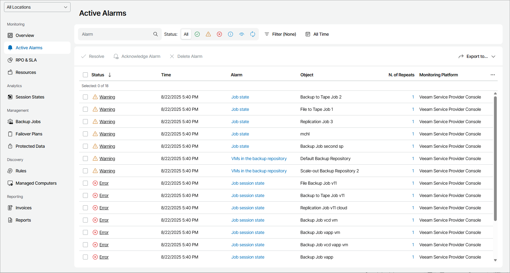

# Viewing and Exporting Triggered Alarms

You can view triggered alarms and export alarm details to a CSV or XML file.

Required Privileges

To perform this task, a user must have one of the following roles assigned: Company Owner, Company Administrator, Company Tenant, Location Administrator, Location User, Subtenant.

Viewing and Exporting Triggered Alarms

To view and export triggered alarm details:

1. Log in to Veeam Service Provider Console.

For details, see [Accessing Veeam Service Provider Console](access_vac.md).

1. In the menu on the left, click Active Alarms.

Veeam Service Provider Console will display a list of all triggered alarms.

To narrow down the list of alarms, you can apply the following filters:

* Alarm — search triggered alarms by name.
* Status — limit the list of alarms by the alarm status (Resolved, Warning, Error, Information, Acknowledged, Processing).
* Product — limit the list of alarms by product (Veeam Backup & Replication (including public cloud backup), Veeam ONE, Veeam Backup for Microsoft 365, Veeam Agent).
* Monitoring platform — limit the list of alarms by the monitoring platform where alarms were triggered (Veeam ONE, Veeam Service Provider Console).
* Time Period — limit the list of alarms by the time when alarms were triggered.
* Location — limit the list of alarms by location for which alarms were triggered. To limit the list of alarms by location, use filter at the top left corner of the Veeam Service Provider Console window.

1. To view information about triggered alarms:

* To view alarm details, click the alarm Status link.
* To view an alarm cause and resolution steps, click the Alarm link.
* To view the history of alarm status changes, click the N of Repeats link. In the displayed window, click the Status link to view a condition that caused the alarm status change.

1. To export alarm details, click Export to and choose a format of the exported data:

* CSV — choose this option to structure exported data as a CSV file.
* XML — choose this option to structure exported data as an XML file.

The file with exported data will be saved to the default download location on your computer.

Each alarm in the list is described with the following properties. By default, some properties in the list are hidden. To display additional properties, click the ellipsis on the right of the list header and choose properties that must be displayed.

If a job for which the alarm were triggered is assigned to a company by the service provider, some details on the triggered alarm may not be displayed.

* Status — alarm status (Resolved, Warning, Error, Information, Acknowledged). Click the alarm status link to view alarm details.
* Location — name of a location for which the alarm was triggered.
* Hostname — name of a machine where the alarm was registered (for example, client backup server, Veeam Service Provider Console server).
* Time — date and time when the alarm was triggered.
* Alarm — alarm name. Click the alarm name link to view a knowledge base article for the alarm.
* Object — name of an object that caused the alarm.
* Country — country and region of the company for which the alarm was triggered.
* N. of Repeats — number of times that the alarm changed its status. Click the alarm repeats link to view the alarm history.
* Alarm Description — description of the alarm.

For resolved and acknowledged alarms, the alarm description includes name of the user who resolved or acknowledged the alarm.

* Monitoring Platform — name of the monitoring platform where the alarm was triggered (Veeam ONE, Veeam Service Provider Console).
* Comment — comment for alarm resolving or acknowledging.

