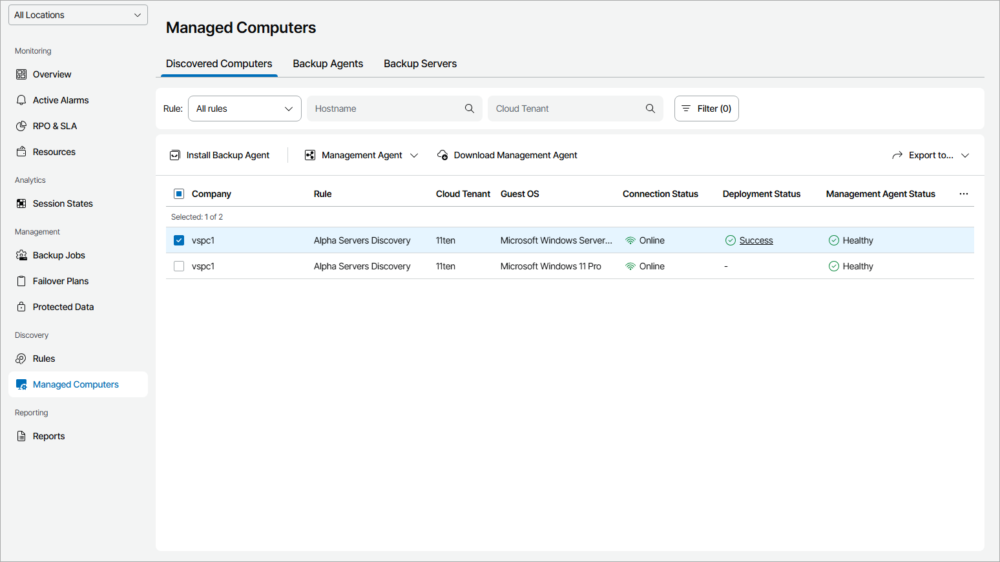

# Viewing and Exporting Discovery Results

You can view results of a performed discovery and export the list of discovered computers to a CSV or XML file.

Viewing Discovered Computers

To view the list of discovered computers:

1. Log in to Veeam Service Provider Console.

For details, see [Accessing Veeam Service Provider Console](access_vac.md).

1. In the menu on the left, click Rules.
2. Do one of the following:

* Click a link in the Total Computers column to view computers discovered by a specific discovery rule.
* Select or right-click a rule in the list and click View Discovered Computers.

1. On the Discovered Computers tab of the Managed Computers section, you can apply the following filters to narrow down the list of discovered computers:

* Rule — limit the list of computers by discovery rule.

Choose External discovery to display computers that were not discovered with discovery rules, but rather with the help of Veeam Service Provider Console management agents running on these computers.

* Hostname — search discovered computers by host name.
* Cloud Tenant — search discovered computers by the Veeam Cloud Connect tenant name.
* Connection status — limit the list of computers by connection status (Online, Restarting, Inaccessible, Rejected, Unverified).
* Management agent status — limit the list of computers by the Veeam Service Provider Console management agent connection status (Healthy, Warning, Error, Not installed, Rejected).
* Platform — limit the list of computers by platform type (Physical, Virtual, Cloud, Undefined).
* OS type — limit the list of computers by OS type supported by Veeam Service Provider Console (Supported, Unsupported, Undefined).
* Management agent version — limit the list of computers by Veeam backup agent version (Up-to-date, Out-of-date, Patch available, Unknown, N/A).
* Guest OS — limit the list of computers by guest OS (Windows, Linux, macOS).
* Location — limit the list of computers by location to which they belong. To limit the list of computers by location, use filters at the top left corner of the Veeam Service Provider Console window.

Each computer in the list is described with a set of properties. By default, some properties in the list are hidden. To display additional properties, click the ellipsis on the right of the list header and choose properties that must be displayed.

* Company — company to which a computer belongs.
* Site — name of the Veeam Cloud Connect site on which the company is registered.
* Location — location to which a computer belongs.
* Rule — name of a discovery rule that was used to discover a computer.

External Discovery means that a computer was not discovered with a discovery rule, but rather with the help of a Veeam Service Provider Console management agent running on these computers.

* Platform — computer platform type (Physical, Virtual, Cloud, Undefined).
* Hostname — computer name.
* Cloud Tenant — cloud tenant to which a computer belongs.
* Tag — tag assigned to Veeam management agent.
* Type — computer type.
* Guest OS — guest OS installed on a computer.
* Application — applications installed on a computer.
* Connection Status — computer connection status (Online, Inaccessible, Rejected, Unverified).
* Deployment Status — status of the Veeam product deployment (Success, Failed, Warning).

You can click a link in the Deployment Status column to view deployment progress, download session logs or cancel Veeam product deployment.

[For all roles except for Location User] If needed, you can click Clear Logs to update the status. For example, if the deployment was canceled and the Deployment Status is Error, you can clear logs to remove the Error status.

* Deployment Progress — progress of the Veeam product deployment, in percent.
* Installation File Download Status — status of the Veeam Backup & Replication installation file download (Success, Failed, Downloading).

You can click a link in the Installation File Download Status column to view the download progress or cancel the download.

* Scheduled Deployment — date and time of the scheduled Veeam Backup & Replication deployment.

You can click a link in the Scheduled Deployment column to reschedule Veeam Backup & Replication deployment, start deployment immediately or cancel scheduled deployment.

* Management Agent Status — Veeam Service Provider Console management agent connection status (Healthy, Warning, Error, Not installed, Rejected).
* Management Agent Version — version of a Veeam Service Provider Console management agent (Up-to-date, Out-of-date, Patch available, N/A).
* Backup Policy — name of a backup policy or a number of backup policies assigned to a Veeam backup agent.

You can click a link in the Backup Policy column to manage assigned policies and configure jobs for the selected computer.

* * Registration Time — date and time when a Veeam Service Provider Console management agent was connected to Veeam Service Provider Console.
  * IP Address — computer IP address.
  * MAC Address — computer MAC address.
  * Discovery Time — date and time when a computer was discovered.
  * Agent Role — role of a Veeam Service Provider Console management agent (Master, Client).
  * Last Heartbeat — time period since a Veeam Service Provider Console management agent sent the latest heartbeat to Veeam Service Provider Console.
  * Reboot Required — indicates whether computer reboot is required.

Exporting Discovered Computers

You can export discovered computer details to a CSV or XML file:

1. Log in to Veeam Service Provider Console.

For details, see [Accessing Veeam Service Provider Console](access_vac.md).

1. In the menu on the left, click Managed Computers.
2. Open the Discovered Computers tab .
3. Apply the necessary filters.
4. Click Export to and choose a format of the exported data:

* CSV — choose this option to structure exported data as a CSV file.
* XML — choose this option to structure exported data as an XML file.

The file with exported data will be saved to the default download location on your computer.

