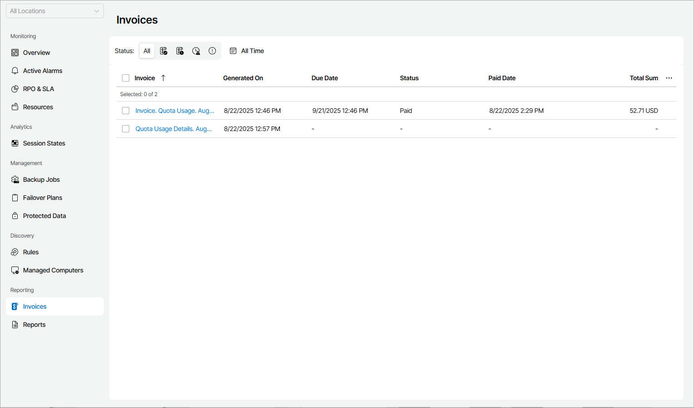
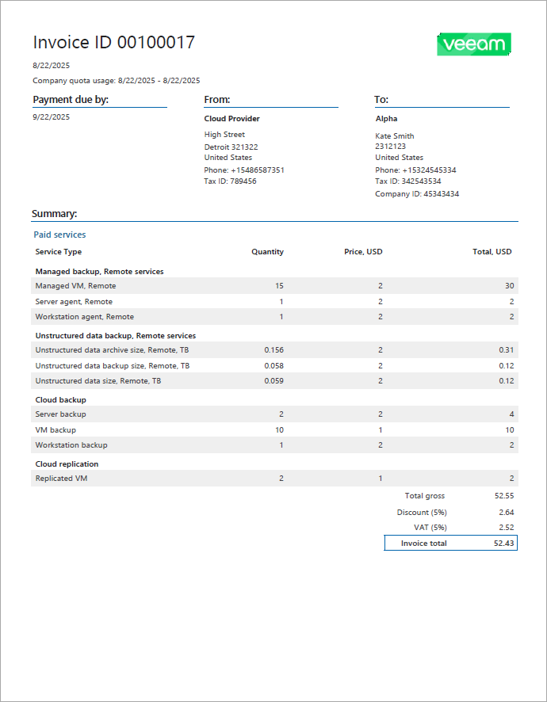

# Viewing and Downloading Invoices

In the Client Portal, you can view details of invoices that your service provider generated for your company. Invoices are available as PDF documents that you can download to view the details.

Required Privileges

To perform this task, a user must have one of the following roles assigned: Company Owner, Company Administrator, Company Invoice Auditor.

Viewing Invoices

To view invoice details:

1. Log in to Veeam Service Provider Console.

For details, see [Accessing Veeam Service Provider Console](access_vac.md).

1. In the menu on the left, click Invoices.

Veeam Service Provider Console will display a list of invoices. To narrow down the list of invoices, you can use the following filters:

* Status — limit the list of invoices by payment status (Paid, Unpaid, Overdue, Information).
* Time period — limit the list of invoices by generation date.

1. Select the necessary invoice in the list and click a link in the Invoice column.

The invoice PDF file will be saved to the default download location on your computer.

Each invoice in the list is described with a set of properties. By default, some properties in the list are hidden. To display additional properties, click the ellipsis on the right of the list header and choose properties that must be displayed.

* Site — name of the Veeam Cloud Connect site on which the company is registered.
* Invoice — link to download an invoice.
* Generated On — date and time when an invoice was generated.
* Due Date — date by which your company must make a payment.
* Status — invoice status.
* Paid Date — date when an invoice was marked as paid.
* Total Sum — total cost of consumed backup services calculated for an invoice.
* Invoice ID — number that uniquely identifies an invoice.
* Subscription Plan — name of a subscription plan which was used to charge a company in Veeam Service Provider Console.

Types of Invoices

Information available in an invoice depends on the invoice type.

Veeam Service Provider Console offers three types of invoices:

* Summary invoice provides information about consumed services and their cost.
* Detailed invoice provides information about consumed services and their cost. In addition, a detailed invoice provides information about services consumed by each company location on each day of a specified period.
* Quota usage report provides information about services consumed by each company location on each day of a specified period. A quota usage report does not include cost details.

Summary Invoice

A summary invoice provides information about consumed services and their cost.

An example of a summary invoice is shown below.

A summary invoice includes the following information:

* Invoice ID — number that uniquely identifies an invoice.
* Generation date — date when an invoice was generated. Date format depends on the date and time settings of the Veeam Service Provider Console server.
* Company quota usage — billing period.
* Payment due by — date by which your company must make a payment. The payment date is one month after the invoice generation date. If an invoice is not paid by the due date, its status is changed to Overdue.
* From — name and contact details of the service provider.
* To — name and contact details of your company.
* Summary — charge rate information specified in the subscription plan, total gross cost, tax and discount, as well as the invoice total. This section also includes the cost breakdown for all types of provided services and the amount of services provided free of charge.

Detailed Invoice

A detailed invoice provides information about consumed services and their cost. In addition, a detailed invoice provides information about services consumed by each company location on each day of a specified period.

An example of a detailed invoice is shown below.

A detailed invoice includes the following information:

* Invoice ID — number that uniquely identifies an invoice.
* Generation date — date when an invoice was generated. Date format depends on the date and time settings of the Veeam Service Provider Console server.
* Company quota usage — billing period.
* Payment due by — date by which your company must make a payment. The payment date is one month after an invoice generation date. If an invoice is not paid by the due date, its status is changed to Overdue.
* From — name and contact details of the service provider.
* To — name and contact details of your company.
* Summary — charge rate information specified in the subscription plan, total gross cost, tax and discount, as well as the invoice total. This section also includes the cost breakdown for all types of provided services and the amount of services provided free of charge.
* Details — information about services consumed by each company location on each day of the quota usage period.

Quota Usage Report

A quota usage report provides information about services consumed by each company location on each day of a specified period. A quota usage report does not include service cost details.

An example of a quota usage report is shown below.

A quota usage report includes the following information:

* Generation date — date when a report was generated. Date format depends on the date and time settings of the Veeam Service Provider Console server.
* Company quota usage — period for which quota usage details are provided.
* From — name and contact details of the service provider.
* To — name and contact details of your company.
* Details — information about services consumed by each company location on each day of the quota usage period.

