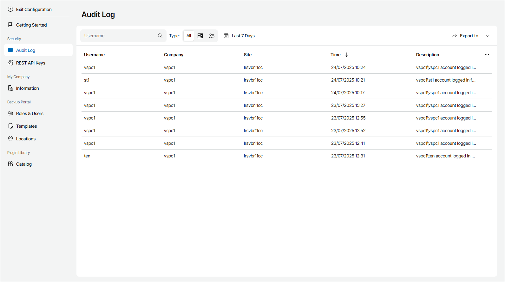

# Viewing and Exporting Event Logs

Veeam Service Provider Console keeps a record of operations in event logs. The logs include statistics for the period configured by your service provider.

Required Privileges

To perform this task, a user must have the following role assigned: Company Owner.

Viewing and Exporting Event Log Details

The event log keeps track of configuration-, management- and security-related events in Veeam Service Provider Console, for example:

* User account creation and management
* User login attempts and password changes
* Backup policy management

To view event log details and export them to a CSV or XML file:

1. Log in to Veeam Service Provider Console.

For details, see [Accessing Veeam Service Provider Console](access_vac.md).

1. At the top right corner of the Veeam Service Provider Console window, click Configuration.
2. In the configuration menu on the left, click Audit Log.
3. To narrow down the list of records in the log, you can apply the following filters:

* Username — limit the list of events by the name of a user who initiated the event.
* Type — limit the list of events by event type (Internal, External).
* Time period — limit the list of events by time of performance.

1. To export event details, click Export to and choose the format of the exported data:

* CSV — choose this option to structure exported data as a CSV file.
* XML — choose this option to structure exported data as an XML file.

The file with exported data will be saved to the default download location on your computer.

Each event in the list is described with a set of properties.

* Username — name of the user that initiated the event.
* Company — name of the company for which the event was performed.
* Site — Veeam Cloud Connect site on which the company is registered.
* Time — time when the event was performed.
* Description — description of the event.

Note that the event description only provides information about the IP address of the latest proxy server in the network path, and does not include whether the user logged in with MFA.

