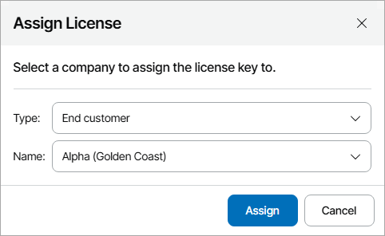

# Assigning License Keys

You can assign license keys internally or to managed resellers and companies. When you assign a license key, VCSP Pulse creates a license for the company and returns created license ID.

|  |
| --- |
| Note: |
| You cannot assign license keys with Multi-Customer Usage usage type. |

Assigning License Keys

To assign license keys:

1. Log in to Veeam Service Provider Console.

For details, see [Accessing Veeam Service Provider Console](access_vac.md).

1. At the top right corner of the Veeam Service Provider Console window, click Configuration.
2. In the configuration menu on the left, click Catalog.
3. Click the VCSP Pulse plugin tile.
4. In the menu on the left, click License Keys.

Veeam Service Provider Console will display a list of all license keys managed in VCSP Pulse.

1. Select the necessary license keys.

To narrow down the list of license keys, you can apply the following filters:

* Company Name — search the list of license keys by name of a company to which the license is assigned.
* Site Name — search the list of license keys by name of a site on which the company is registered.
* Product — search the list of license keys by the name of the product for which the license is assigned (Veeam Backup Agents, Veeam Backup & Replication Enterprise, Veeam Backup & Replication Enterprise Plus, Veeam Backup & Replication Standard, Veeam Backup for Microsoft 365, Veeam Cloud Connect & Public Cloud, Veeam ONE).
* Assignment Status — limit the list of license keys by assignment status (Assigned, Not Assigned).
* Usage Type — limit the list of license keys by usage type (Single-customer use, Internal, Multi-customer use).
* Automatic Reporting — limit the list of license keys by automatic reporting status (Enabled, Disabled).
* Company Type — limit the list of license keys by type of a company to which the license is assigned (Unassigned, End customer, Reseller, My company).

1. At the top of the list, click License Actions and select Assign.

Alternatively, you can right-click the necessary license key, choose License Actions and select Assign.

1. In the Assign License window, select company type and the company to which you want to assign the license.
2. Click Assign.

