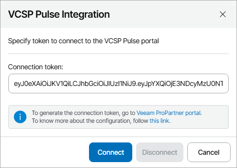
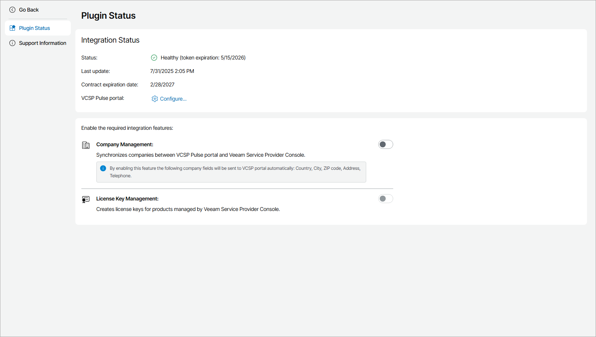

# Step 2. Configure Plugin Connection

Configure VCSP Pulse plugin connection in Veeam Service Provider Console:

1. Log in to Veeam Service Provider Console.

For details, see [Accessing Veeam Service Provider Console](access_vac.md).

1. At the top right corner of the Veeam Service Provider Console window, click Configuration.
2. In the configuration menu on the left, click Catalog.
3. Click the VCSP Pulse plugin tile.
4. In the VCSP Pulse Integration window, enter the connection token you generated at [Step 1. Obtain VCSP Pulse Connection Token](pulse_obtain_token.md).

1. Click Connect.
2. In the VCSP Pulse Integration window, check integration status.

A successfully established connection will show the Healthy integration status and connection token expiration date.

Disconnecting VCSP Pulse Plugin

If you no longer want to manage VCSP Pulse license keys in Veeam Service Provider Console, you can remove plugin connection. After you disconnect VCSP Pulse plugin, company mapping and merge will be reset and you will not be able to assign VCSP Pulse license keys to managed products. Licenses installed on managed products before the plugin disconnection will not be affected.

To disconnect plugin:

1. Log in to Veeam Service Provider Console.

For details, see [Accessing Veeam Service Provider Console](access_vac.md).

1. At the top right corner of the Veeam Service Provider Console window, click Configuration.
2. In the configuration menu on the left, click Catalog.
3. Click the VCSP Pulse plugin tile.
4. Click Configure.
5. In the VCSP Pulse Integration window, click Disconnect.

