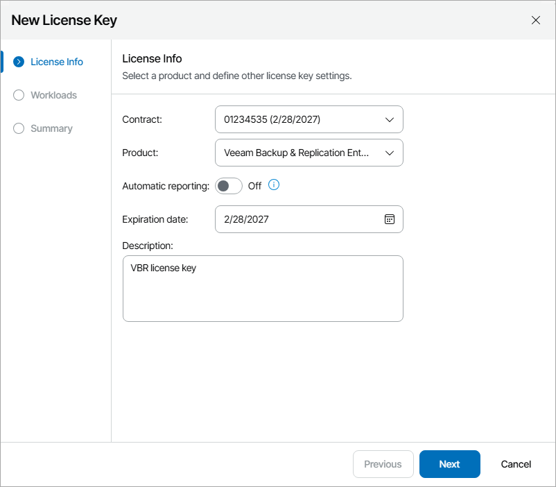
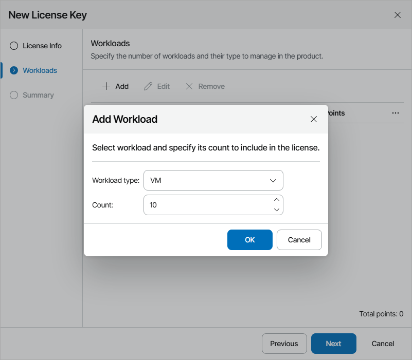
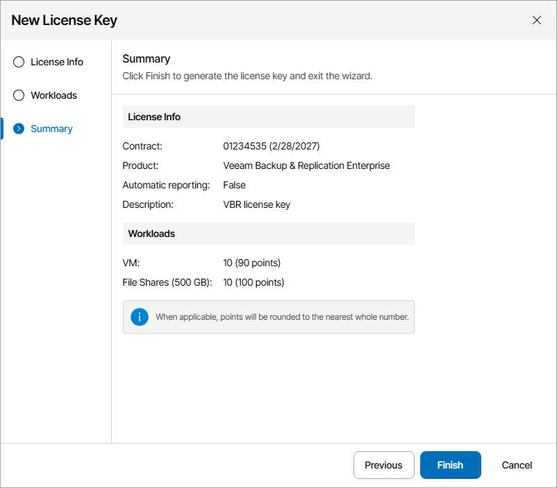

# Creating License Keys

You can create license keys assigned to contracts from VCSP Pulse.

When you create a license key, plugin creates a license template for VCSP Pulse. While a license key is not assigned, the VCSP Pulse contract will not be charged for workloads included in this license key. Note that you can create only license keys with Single-Customer Usage usage type. It is recommended to assign one license key to one company.

Creating License Keys

To create new license keys:

1. Log in to Veeam Service Provider Console.

For details, see [Accessing Veeam Service Provider Console](access_vac.md).

1. At the top right corner of the Veeam Service Provider Console window, click Configuration.
2. In the configuration menu on the left, click Catalog.
3. Click the VCSP Pulse plugin tile.
4. In the menu on the left, click License Keys.
5. At the top of the list, click New License.

Veeam Service Provider Console will launch the New License Key wizard.

1. At the License Info step of the wizard, specify the following settings:

1. In the Contract list, select the necessary VCSP Pulse contract.
2. In the Product list, select product for which you want to create a license key.
3. If you do not want to report on the license automatically, set the Automatic reporting toggle to Off.

If you do not have license-level reporting enabled for your VCSP Pulse account, the toggle will be inactive and set to Off. For details on how to enable license-level reporting, see section [Automatic License Reporting](https://helpcenter.veeam.com/docs/vcsp/refguide/automatic_license_reporting.html) of the Veeam Rental Licensing and Usage Reporting Reference Guide.

Note that if you have selected a No Commit contract in the Contract list, the toggle will be inactive and set to On. For details on VCSP licensing agreements, see section [Rental Agreements and Licensing Terms](https://helpcenter.veeam.com/docs/vcsp/refguide/rental_agreement_terms.html) of the Veeam Rental Licensing and Usage Reporting Reference Guide.

1. In the Expiration date field, specify license expiration date.

Note that if you have selected a No Commit contract in the Contract list or if you have set the Automatic reporting toggle to On, the field will be inactive. Expiration date for automatically reported licenses is calculated after the license key is created. Such licenses are issued for 2,5 months and will be extended automatically only if you submit license usage report for this license. For details, see [Submitting License Usage Report](submit_license_usage_report.md).

1. In the Description field, specify license key description.

1. At the Workloads step of the wizard, specify workloads that will be included in the license:

1. At the top of the list, click Add.
2. In the Add Workload window, specify workload type and the number of workloads you want to add.

The list of available workloads will depend on the selected product.

1. Click OK.
2. Repeat steps a–c for all workloads you want to add.

1. At the Summary step of the wizard, review license key settings and click Finish.

|  |
| --- |
| Note: |
| If the created license key includes non-integral number of points, VCSP Pulse will round up the number of points automatically. |

