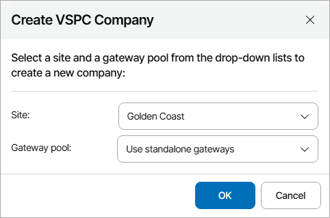

# Creating New Companies in Veeam Service Provider Console

You can create companies in Veeam Service Provider Console based on contact data from accounts of companies managed in VCSP Pulse.

When you create a new company, Veeam Service Provider Console:

1. Retrieves company ID and general company data from VCSP Pulse.
2. Creates an account based on retrieved information and maps it automatically to a source company in VCSP Pulse.
3. Sends a welcome email message at the address specified in the Company Info section of the company settings.

For details, see [Sending Welcome Email Message](send_welcome_email.md).

|  |
| --- |
| Note: |
| Veeam Service Provider Console will not be able to send a welcome email message until you configure SMTP server settings and global notification policy settings. For details, see [Configuring Notification Settings](configure_email_settings.md). |

Creating Companies

To create new companies in Veeam Service Provider Console:

1. Log in to Veeam Service Provider Console.

For details, see [Accessing Veeam Service Provider Console](access_vac.md).

1. At the top right corner of the Veeam Service Provider Console window, click Configuration.
2. In the configuration menu on the left, click Catalog.
3. Click the VCSP Pulse plugin tile.
4. In the menu on the left, click Companies.

Veeam Service Provider Console will display a list of all companies managed in VCSP Pulse and Veeam Service Provider Console.

1. From the list of companies, select unmapped VCSP Pulse companies for which you want to create companies in Veeam Service Provider Console.

To narrow down the list of companies, you can apply the following filters:

* Company Name — search companies by name configured in Veeam Service Provider Console or VCSP Pulse.
* Site — limit the list of companies by Veeam Cloud Connect server on which the company is registered.
* Status — limit the list of companies by mapping status (Mapped, Unmapped, Creating, Error, All).
* Company Source Type — limit the list of companies by source (VCSP Pulse, Veeam Service Provider Console, All).

1. At the top of the list, click Create Company and select In Veeam Service Provider Console.
2. [If you have several Veeam Cloud Connect sites or several gateway pools connected] In the Create VSPC Company window, select the Veeam Cloud Connect server, in which you want to create the company, and the gateway pool that will be available to the company.

|  |
| --- |
| Note: |
| If you want to provide backup or replication services to created companies, you must allocate resources to them. For details, see [Modifying Company Settings](modify_tenants.md). |

