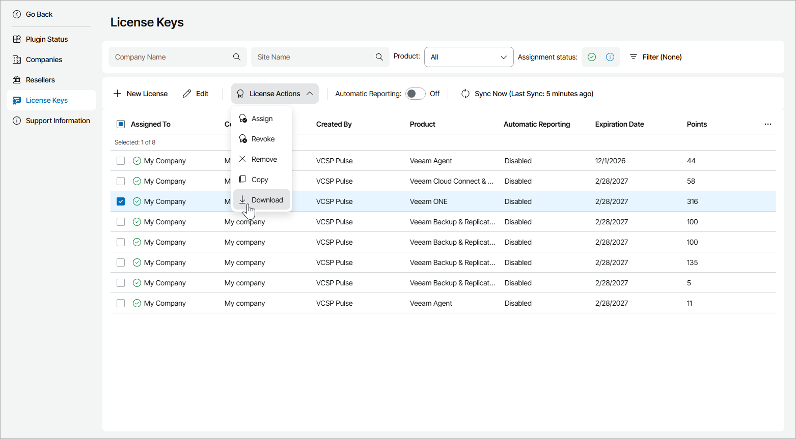

# Viewing and Downloading License Keys

You can view license keys created in Veeam Service Provider Console plugin and in VCSP Pulse and download assigned license key files.

To view and download license keys:

1. Log in to Veeam Service Provider Console.

For details, see [Accessing Veeam Service Provider Console](access_vac.md).

1. At the top right corner of the Veeam Service Provider Console window, click Configuration.
2. In the configuration menu on the left, click Catalog.
3. Click the VCSP Pulse plugin tile.
4. In the menu on the left, click License Keys.

Veeam Service Provider Console will display a list of all license keys managed in VCSP Pulse.

1. Select the necessary license keys.

To narrow down the list of license keys, you can apply the following filters:

* Company Name — search the list of license keys by name of a company to which the license is assigned.
* Site Name — search the list of license keys by name of a site on which the company is registered.
* Product — search the list of license keys by the name of the product for which the license is assigned (Veeam Backup Agents, Veeam Backup & Replication Enterprise, Veeam Backup & Replication Enterprise Plus, Veeam Backup & Replication Standard, Veeam Backup for Microsoft 365, Veeam Cloud Connect & Public Cloud, Veeam ONE).
* Assignment Status — limit the list of license keys by assignment status (Assigned, Not Assigned).
* Usage Type — limit the list of license keys by usage type (Single-customer use, Internal, Multi-customer use).
* Automatic Reporting — limit the list of license keys by automatic reporting status (Enabled, Disabled).
* Company Type — limit the list of license keys by type of a company to which the license is assigned (Unassigned, End customer, Reseller, My company).

1. At the top of the list, click License Actions and select Download.

Alternatively, you can right-click the necessary license key, choose License Actions and select Download.

If you have selected assigned and not assigned license keys, only license key files assigned to your company, your client company or reseller client company will be downloaded.

Each license key in the list is described with the following properties:

* Assigned To — name of a company to which a license key is assigned.

If one license key is assigned to multiple companies, click a link in the Assigned To column to drill down to the list of companies to which the license key is assigned.

* Company Type — type of a company to which a license key is assigned (Unassigned, End customer, Reseller, My company).
* Created By — name of a user who created the license key.
* Site Name — name of the Veeam Cloud Connect site on which the company is registered.
* License ID — ID of the license key.
* Product — name of a product for which the license key is assigned (Veeam Backup Agents, Veeam Backup & Replication Enterprise, Veeam Backup & Replication Enterprise Plus, Veeam Backup & Replication Standard, Veeam Backup for Microsoft 365, Veeam Cloud Connect & Public Cloud Workloads, Veeam ONE).
* Automatic Reporting — status of license auto reporting (Enabled, Disabled).
* Expiration Date — date when the license key will expire.
* Points — number of points included in a license key.
* Description — description of a license key.
* Hostname — name of a computer on which product with installed license key is deployed.

If you have installed one license key on multiple products, click a link in the Hostname column to drill down to the list of computers on which licensed products are deployed.

