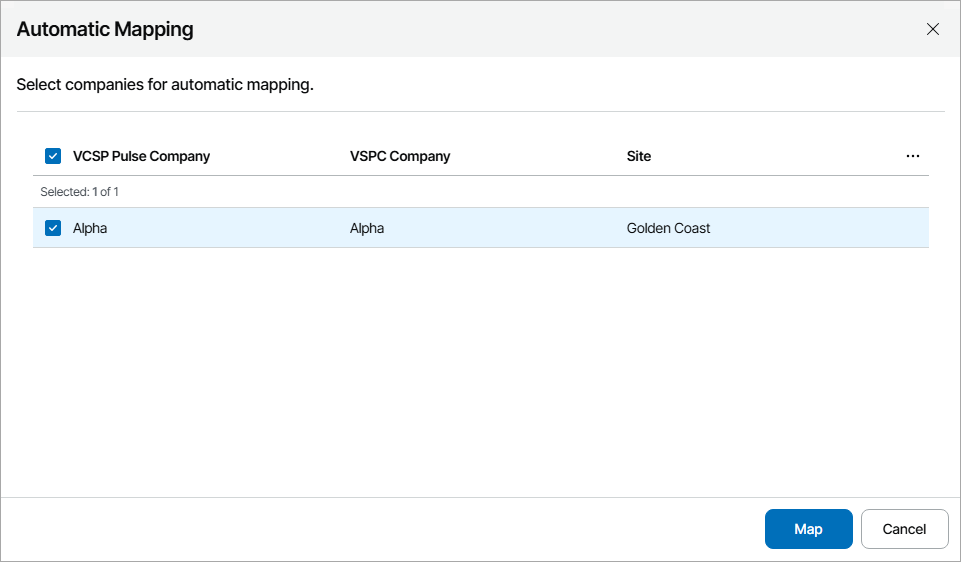
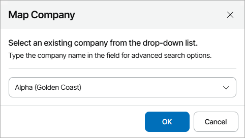

# Mapping Companies

To map companies in VCSP Pulse to companies in Veeam Service Provider Console, you can use one of the following methods:

* [Map companies automatically](#auto)

Select this method if names of companies you manage in Veeam Service Provider Console are same or similar to their names in VCSP Pulse.

* [Map companies manually](#manual)

Select this method if names of companies you manage in Veeam Service Provider Console and their names in VCSP Pulse do not match.

For you to map a reseller, the reseller must configure VCSP Pulse integration. After that, reseller will be mapped automatically.

To see all mapped resellers, navigate to the Resellers tab of the VCSP Pulse plugin.

Mapping Companies Automatically

To map companies automatically:

1. Log in to Veeam Service Provider Console.

For details, see [Accessing Veeam Service Provider Console](access_vac.md).

1. At the top right corner of the Veeam Service Provider Console window, click Configuration.
2. In the configuration menu on the left, click Catalog.
3. Click the VCSP Pulse plugin tile.
4. In the menu on the left, click Companies.

Veeam Service Provider Console will display a list of all companies managed in VCSP Pulse or Veeam Service Provider Console.

1. At the top of the list, click Automap.

This will automatically detect companies in VCSP Pulse with the names same or similar to the names of companies configured in Veeam Service Provider Console.

1. In the displayed list of matched companies, select the necessary companies and click Map.

Mapping Companies Manually

To map companies manually:

1. Log in to Veeam Service Provider Console.

For details, see [Accessing Veeam Service Provider Console](access_vac.md).

1. At the top right corner of the Veeam Service Provider Console window, click Configuration.
2. In the configuration menu on the left, click Catalog.
3. Click the VCSP Pulse plugin tile.
4. In the menu on the left, click Companies.

Veeam Service Provider Console will display the list of all companies managed in VCSP Pulse or Veeam Service Provider Console.

1. From the list of companies, select an unmapped company.

To narrow down the list of companies, you can apply the following filters:

* Company Name — search companies by name configured in Veeam Service Provider Console or VCSP Pulse.
* Site — limit the list of companies by Veeam Cloud Connect server on which the company is registered.
* Status — limit the list of companies by mapping status (Mapped, Unmapped, Creating, Error, All).
* Company Source Type — limit the list of companies by source (VCSP Pulse, Veeam Service Provider Console, All).

1. At the top of the list, click Mapping and select Map to.
2. In the Map Company window, type the name of a company which you want to map.

If you map an existing Veeam Service Provider Console company, type the name of VCSP Pulse company. If you map an existing VCSP Pulse company, type the name of Veeam Service Provider Console company.

1. Click OK.

1. Repeat steps 6–9 for all companies you want to map.

