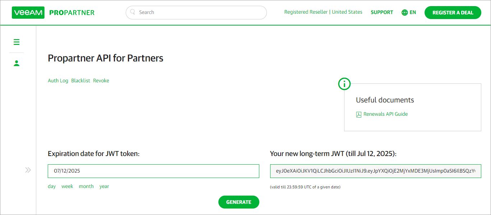

# Step 1. Obtain VCSP Pulse Connection Token

Generate a connection token for VCSP Pulse:

1. Log in to [Veeam ProPartner](https://propartner.veeam.com/) portal.
2. Open the [Propartner API for Partners](https://propartner.veeam.com/swagger/) page.
3. In the Expiration date for JWT token field, specify date when the token will expire.

It is recommended to specify an expiry period of 6 months or less.

After the token expires, all integration between Veeam Service Provider Console and VCSP Pulse will be disabled. License keys installed before token expiration will not be affected.

1. Click Generate.

The connection token will display.

1. If you are enrolled in the VCSP Pulse Site/Location Reporting, you must map the created token to a VCSP Pulse location:

1. From the VCSP Pulse Site/Location drop-down list, select the necessary VCSP Pulse location.

One location can be mapped to only one token. If you want to map a new token to a mapped location, you must replace the existing token.

1. Click Save to Pulse.
2. If you were replacing a previously mapped token, confirm the new mapping.

Note that if you do not map the token to a VCSP Pulse location, you will not be able to create new licenses in the Veeam Service Provider Console plugin.

1. Copy and save the connection token.

