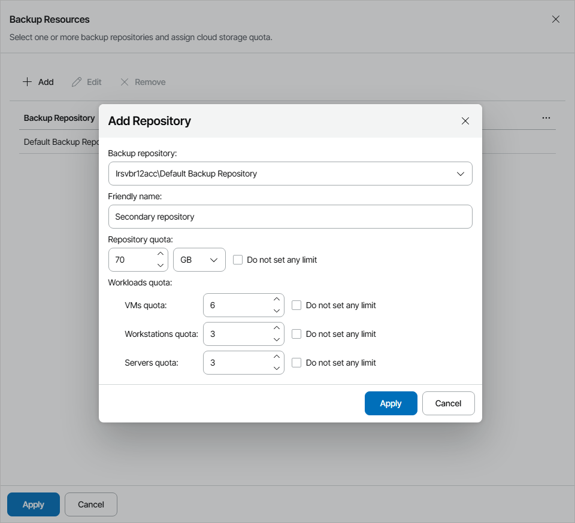

# Allocating Cloud Backup Resources

In the Backup Resources window, you can allocate cloud repository resources to a reseller. A reseller to which cloud repository resources are allocated will be able to store in the cloud client backups created with Veeam Backup & Replication and Veeam backup agents.

Provisioning of cloud repository resources requires a license that covers storing backups in the cloud. For details, see [Licensing](licensing.md).

To allocate cloud repository resources to a reseller, configure a cloud repository:

1. Click Add.
2. From the Backup repository list, select a backup repository on one of the Veeam Cloud Connect sites selected at the [Cloud Connect Server](reseller_site_scope.md) step.
3. In the Cloud repository name field, specify a friendly name of a cloud repository.
4. In the Repository quota field, specify the amount of space that you want to allocate to the reseller on the selected backup repository.

You can specify the size of the reseller quota or create an unlimited quota. With an unlimited quota, the reseller can consume all storage space on the selected repository.

1. To define the number of VMs and Veeam backup agents for the cloud repository:

1. Make sure the Do not set any limit check box is cleared.
2. In the VMs quota field, specify the maximum number of VMs that the reseller clients can store on the cloud repository.

The VMs quota is a soft quota and puts no physical restriction on the cloud repository. When the reseller reaches the specified quota, Veeam Service Provider Console triggers the Reseller VM cloud backups quota alarm. You can customize this alarm in accordance with your requirements. For details, see [Modifying Alarm Settings](modify_alarm_settings.md).

Reseller users will see this quota on the Cloud Connect Resources dashboard. For details, see section [Resources & Billing](https://helpcenter.veeam.com/docs/vac/reseller/summary_dashboard.html#backup) of the Guide for Resellers.

1. In the Workstations quota field, specify the maximum number of Veeam backup agents operating in the Workstation mode that the reseller clients can store on the cloud repository.

The Workstations quota is a soft quota and puts no physical restriction on the cloud repository. When the reseller reaches the specified quota, Veeam Service Provider Console triggers the Reseller workstation cloud backups quota alarm. You can customize this alarm in accordance with your requirements. For details, see [Modifying Alarm Settings](modify_alarm_settings.md).

Reseller users will see this quota on the Cloud Connect Resources dashboard. For details, see section [Resources & Billing](https://helpcenter.veeam.com/docs/vac/reseller/summary_dashboard.html#backup) of the Guide for Resellers.

1. In the Servers quota field, specify the maximum number of Veeam backup agents operating in the Server mode that the reseller clients can store on the cloud repository.

The Servers quota is a soft quota and puts no physical restriction on the cloud repository. When the reseller reaches the specified quota, Veeam Service Provider Console triggers the Reseller server cloud backups quota alarm. You can customize this alarm in accordance with your requirements. For details, see [Modifying Alarm Settings](modify_alarm_settings.md).

Reseller users will see this quota on the Cloud Connect Resources dashboard. For details, see section [Resources & Billing](https://helpcenter.veeam.com/docs/vac/reseller/summary_dashboard.html#backup) of the Guide for Resellers.

For details about VMs and Veeam backup agents stored in the cloud, see [Services](services.md).

1. Click Apply.
2. Repeat steps 1–7 for all cloud repositories that you want to allocate to a reseller.
3. Click Apply.

