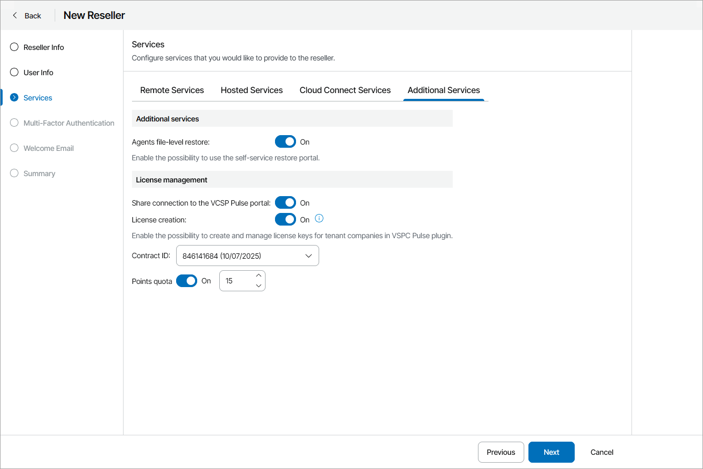

# Configure Additional Services

On the Additional Services tab, you can enable file-level restore and license creation for the reseller:

* To allow reseller companies to perform file-level restore, set the Agents file-level restore toggle to On.

* If you want to allow the reseller to use your VCSP Pulse connection token, set the Share connection to the VCSP Pulse portal toggle to On.

In this case, the VCSP Pulse plugin for the reseller will be configured automatically with your connection token.

* To allow reseller to create and manage license keys for tenant companies in the VCSP Pulse plugin, set the License creation toggle to On and assign a VCSP Pulse contract.

This option is available if you have configured VCSP Pulse integration. For details, see [Integration with VCSP Pulse](integration_pulse.md).

To assign a VCSP Pulse contract to the reseller:

1. If necessary, in the Contract ID list, change the VCSP Pulse contract that you want to assign to the reseller.
2. To limit the amount of points the reseller can assign to tenant companies, set the Points quota toggle to On and specify the points quota.

After you assign a VCSP Pulse contract, the reseller will be able to create license keys for managed companies. If you do not enable license creation, the reseller will only be able to assign and revoke licenses that you assign to the reseller in the VCSP Pulse plugin. Users of the companies managed by the reseller will not be able to view and download assigned license keys.

