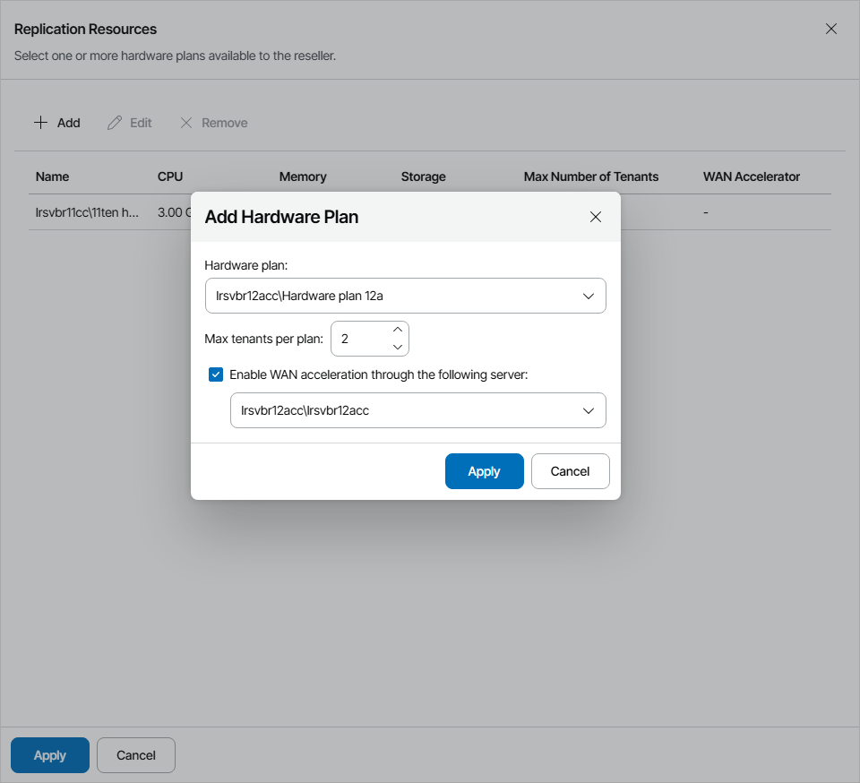

# Allocating Cloud Replication Resources

In the Replication Resources window, you can assign to the reseller one or more hardware plans. A reseller can subscribe managed companies to assigned hardware plans.

Hardware plans must be configured in Veeam Cloud Connect in advance. For details, see section [Configuring Hardware Plans](https://helpcenter.veeam.com/docs/backup/cloud/cloud_connect_configure_hardware_plan.html) of the Veeam Cloud Connect Guide.

To assign one or more hardware plans to the reseller:

1. Click Add.
2. In the Add Hardware Plan window, choose a hardware plan configured on one of the Veeam Cloud Connect sites selected at the [Site Scope](reseller_site_scope.md) step.
3. In the Max tenants per plan field, specify the maximum number of companies that a reseller can subscribe to a hardware plan.

The Max tenants per plan quota is a soft quota and puts no physical restriction on the cloud host. When the reseller reaches the specified quota, Veeam Service Provider Console triggers the Reseller hardware plans quota alarm. You can customize this alarm in accordance with your requirements. For details, see [Modifying Alarm Settings](modify_alarm_settings.md).

1. If at the Services step you enabled WAN Acceleration for a reseller, select the Enable WAN acceleration through the following servers check box and choose a target WAN accelerator configured on the service provider side.

The source WAN accelerator must be configured on the company side. The company must select the source WAN accelerator when configuring a replication job.

1. Click Apply.
2. Repeat steps 1–5 for all hardware plans which you want to assign to the reseller.
3. Click Apply.

