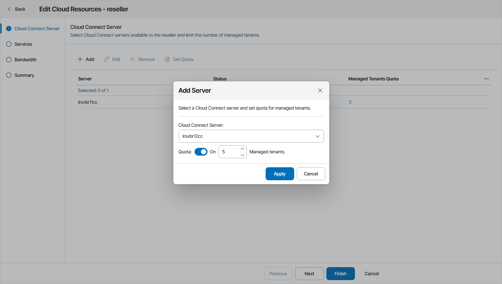

# Step 2. Assign Cloud Connect Servers

At the Cloud Connect Server step of the wizard, specify Veeam Cloud Connect sites whose backup and replication resources will be available to a reseller:

1. At the top of the window, click Add.
2. From the Cloud Connect Server drop-down list, select a Veeam Cloud Connect server that a reseller will use to provide services to companies.
3. To limit the number of company accounts that a reseller can manage on the selected Veeam Cloud Connect server, set the Quota toggle to On and specify the number of managed tenants.

When the reseller reaches the specified quota, Veeam Service Provider Console triggers the Reseller managed tenants quota alarm. Reseller users will not be able to register more tenant accounts than specified in the quota. However, as a Service Provider you can delegate to the reseller management of any number of tenants above the quota.

If you set the toggle to Off, the reseller will be able to manage an unlimited number of tenants on the selected site.

1. Click Apply.
2. Repeat steps 1–4 for all Veeam Cloud Connect sites that you want to allocate to a reseller.

Configuring Site Quota

To limit the number of tenant accounts for one or more Veeam Cloud Connect sites at once:

1. Select the sites from the list and click the Set Quota link.
2. In the Set Quota window, specify the number of tenants that a reseller can manage on each of the selected sites.

