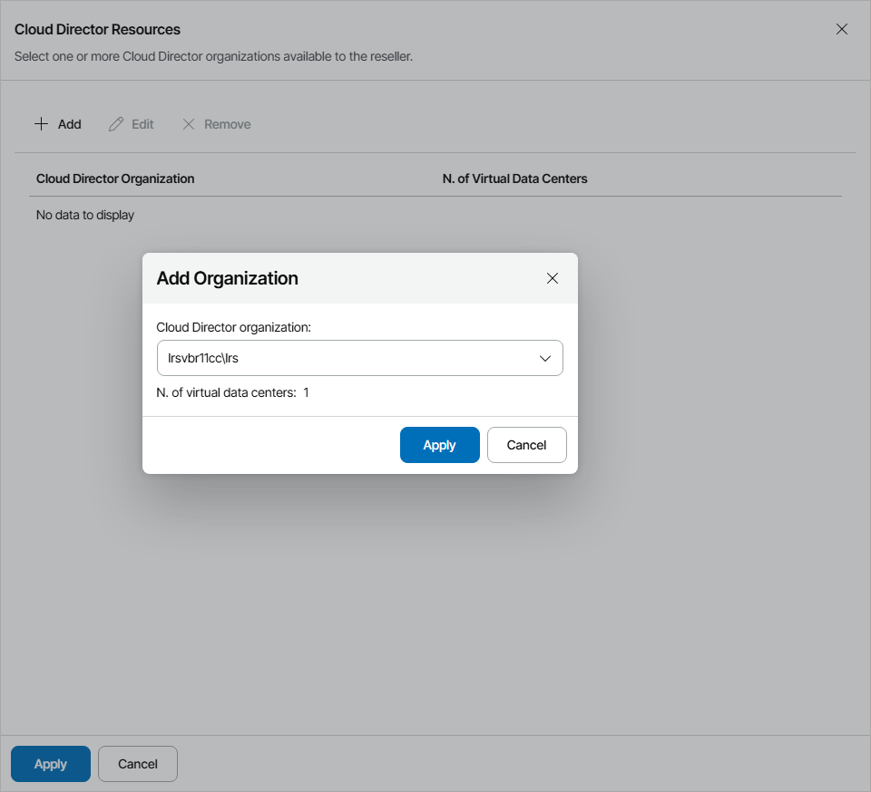

# Allocating VMware Cloud Director Resources

In the Cloud Director Resources window, you can allocate one or more VMware Cloud Director organizations that a reseller can assign to companies. A reseller to which VMware Cloud Director organizations are allocated can provide to managed companies organization VDC resources as cloud hosts.

To provide VMware Cloud Director resources as cloud hosts for client VM replicas, you must configure integration with VMware Cloud Director in Veeam Cloud Connect. For details, see section [VMware Cloud Director Support](https://helpcenter.veeam.com/docs/backup/cloud/cloud_vcloud_director.html) of the Veeam Cloud Connect Guide.

To allocate one or more VMware Cloud Directortor organizations to the reseller:

1. Click Add.
2. In the Add Organization window, choose a VMware Cloud Director organization whose Organization VDC resources you want allocate to the reseller as cloud hosts.

The N. of virtual data centers field will display the number of available VDCs for the selected organization.

1. Click Apply.
2. Repeat steps 1–3 for all VMware Cloud Director organizations which you want to allocate to the reseller.
3. Click Apply.

