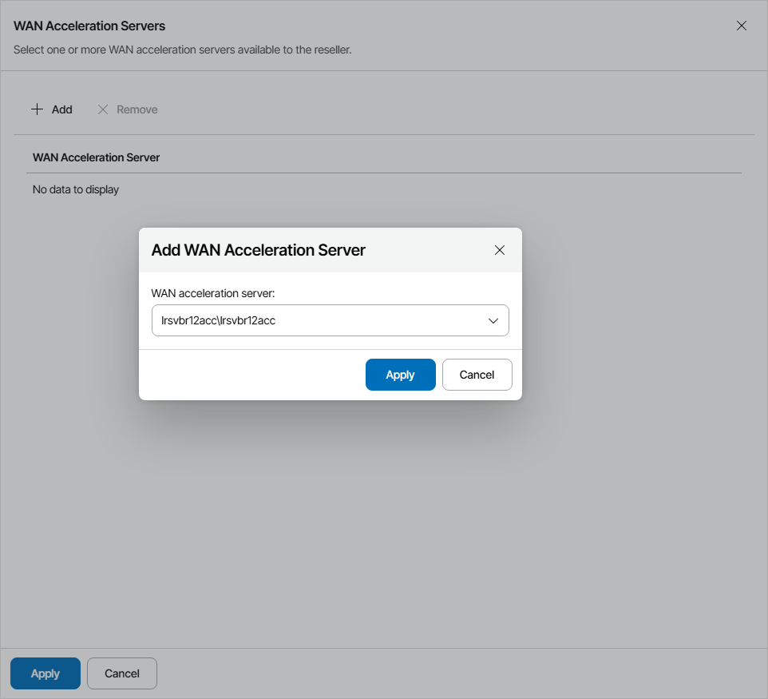

# Allocating WAN Acceleration Resources

In the WAN Acceleration Servers window, you can allocate WAN acceleration server resources to the reseller. A reseller to which WAN acceleration resources are allocated can allow client companies to use WAN accelerators for backup copy jobs that write data to the cloud.

To allocate WAN acceleration resources to the reseller:

1. Click Add.
2. From the WAN acceleration server list, select a server for WAN acceleration.
3. Click Apply.

You can add more than one WAN acceleration server for the reseller. Repeat steps 1–3 for all servers you want to allocate.

