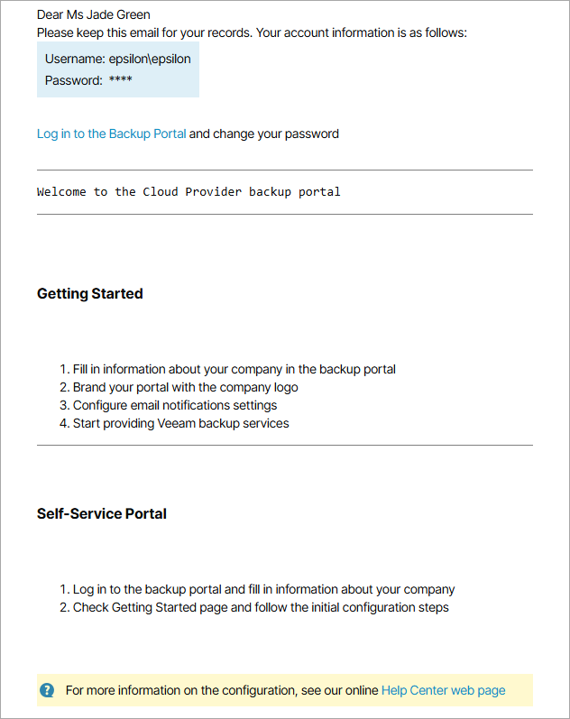

# Sending Welcome Email Message

When you create a new reseller, you can send a welcome email message to users of this reseller.

The email message contains:

* Credentials of the Service Provider Global Administrator for connecting to the service provider and accessing the Reseller Portal.
* Custom text specified at the [Welcome Email](reseller_welcome_email_custom.md) step.
* Link to the Veeam Service Provider Console portal.
* Brief instructions on getting started with Veeam Service Provider Console.

The following image illustrates how a welcome email message looks like.

Before You Begin

Before you send a welcome email message, complete the following prerequisites:

1. [Fill in the company profile](fill_company_profile.md).

Specify your company name and contact details in the company profile. This information will be displayed in the footer of the welcome email message. The email address that you specify in the company profile will be displayed in the From field of the welcome email message.

1. [Customize portal branding](customize_branding.md).

Upload a custom report logo and check the portal web address. The report logo will be displayed in the footer of the welcome email message. The web address will be included in the body, and displayed in the footer of the welcome email message.

1. [Configure SMTP server settings](configure_email_settings.md#smtpServer).

Specify settings of an SMTP server that will be used to send email notifications.

Required Privileges

To perform this task, a user must have the following role assigned: Portal Administrator.

Sending Welcome Email Message to New Resellers

You can send a welcome email message when you create a new reseller:

1. Launch the New Reseller wizard and specify reseller settings.

For details, see [Creating Resellers](create_reseller.md).

1. At the Reseller Info step of the wizard, in the Email Address field, specify an address at which the welcome email message must be sent.
2. At the Summary step of the wizard, select the Send welcome email notification to the client when I click Finish check box.
3. Click Finish.

Veeam Service Provider Console will send an email message at the email address specified in the Reseller Info section of the reseller settings.

Sending Welcome Email Message to Existing Resellers

You can send a welcome email message to already existing resellers.

|  |
| --- |
| Note: |
| An email message sent to an existing reseller does not include the password of the Service Provider Global Administrator. Only the user name is included in the email body. |

To send a welcome email message to one or more existing companies:

1. Log in to Veeam Service Provider Console.

For details, see [Accessing Veeam Service Provider Console](access_vac.md).

1. In the menu on the left, click Resellers.
2. Select one or more resellers in the list.
3. At the top of the list, click Send Welcome Email.

Alternatively, you can right-click the necessary reseller and select Send Welcome Email.

Veeam Service Provider Console will send an email message at the email address specified in the Reseller Info section of the reseller settings.

