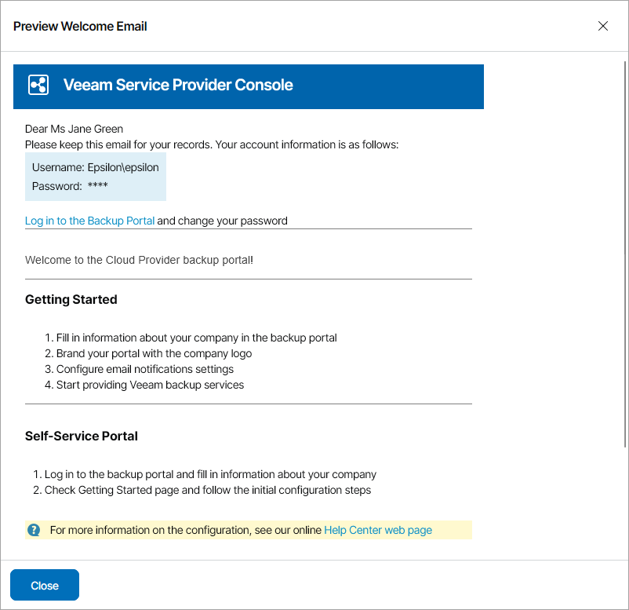

# Step 6. Customize Welcome Email

At the Welcome Email step of the wizard, customize email that will be sent to resellers:

* Specify custom text that will be included into welcome email body.

Custom text section supports plain text and HTML tags.

* To include Self-Service Portal section with instructions for reseller users, select the Include Self-Service Portal section in the welcome email check box.

To see how the welcome email will look like, click the Preview welcome email link.

* To save welcome email settings as a template and use it for all managed resellers, select the Use this template as default for all resellers check box.

If you change the default welcome email and clear the check box, the welcome email settings will be modified only for the created reseller.

