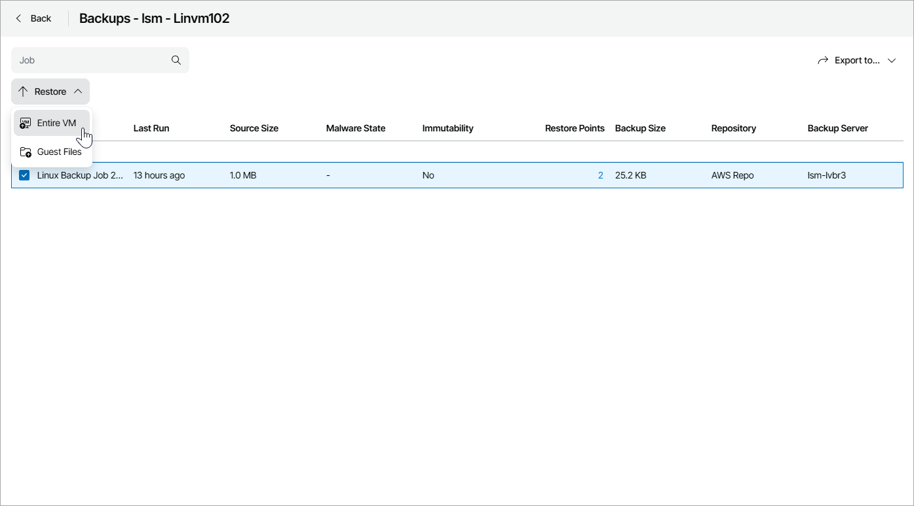

# Restoring Veeam Backup & Replication Workloads

To restore VMs and files from restore points, you can access the Veeam Backup & Replication Web UI directly from Veeam Service Provider Console.

Veeam Service Provider Console supports the following restore types:

* Entire VM restore — recovers the entire VM. When you recover VMs, you extract VM images from backups to the production storage. For details, see section [Entire VM Restore](https://helpcenter.veeam.com/docs/vbr/userguide/full_recovery.html) of the Veeam Backup & Replication User Guide.
* Guest OS files restore — restores individual guest OS files from Windows, Linux, Mac and other guest OS file systems. For details, see section [Guest OS File Restore](https://helpcenter.veeam.com/docs/vbr/userguide/guest_file_recovery.html) of the Veeam Backup & Replication User Guide.

Note that in Veeam Service Provider Console you can restore files and folders only from an image-level backup.

|  |
| --- |
| Note: |
| This functionality is available for Veeam Backup & Replication version 13.0.1 or later. |

Required Privileges

To perform this task, a user must have the following role assigned: Portal Administrator.

Restoring Veeam Backup & Replication Workloads

To access the Veeam Backup & Replication Web UI:

1. Log in to Veeam Service Provider Console.

For details, see [Accessing Veeam Service Provider Console](access_vac.md).

1. In the menu on the left, click Protected Data.
2. Open the Virtual Machines tab and navigate to Virtual Infrastructure.
3. Click a link in the Backups column.

Veeam Service Provider Console will open the Backups window.

1. Select the necessary backup job in the list.
2. At the top of the list, click Restore and select the necessary restore type (Entire VM, Guest Files).

Veeam Service Provider Console will open a restore wizard from the Veeam Backup & Replication Web UI. The guest files restore wizard will open in a new tab.

To restore an entire VM, follow the procedure as described in the Veeam Backup & Replication User Guide, starting from [Step 2. Select VMs and Restore Points](https://helpcenter.veeam.com/docs/vbr/userguide/full_restore_vms_vm_web.html). You can monitor the restore status in the Veeam Backup & Replication Web UI. For details, see section [Viewing Logs and Events](https://helpcenter.veeam.com/docs/vbr/userguide/history_statistics_web.html) in the Veeam Backup & Replication User Guide.

To restore guest files, follow the procedure as described in the Veeam Backup & Replication User Guide, starting from [Step 2. Select Restore Point](https://helpcenter.veeam.com/docs/vbr/userguide/guest_restore_point_vm_web.html).

