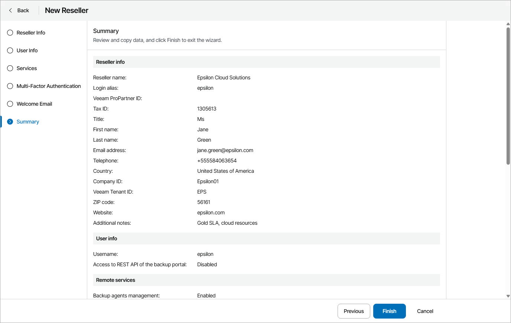

# Step 7. Review Settings

At the Summary step of the wizard, review the reseller account settings.

1. To send a welcome email message to the reseller, select the Send welcome email notification to the client when I click finish check box.

The welcome email message will be sent at the email address that you specified at the [Reseller Info](specify_reseller_details.md) step of the wizard.

The message contains a link to Veeam Service Provider Console, user name and password that the Service Provider Global Administrator can use to access the Reseller Portal, as well as brief instructions on getting started with Veeam Service Provider Console. For details on the welcome email message, see [Sending Welcome Email Message](send_welcome_email.md).

1. Click Finish.

