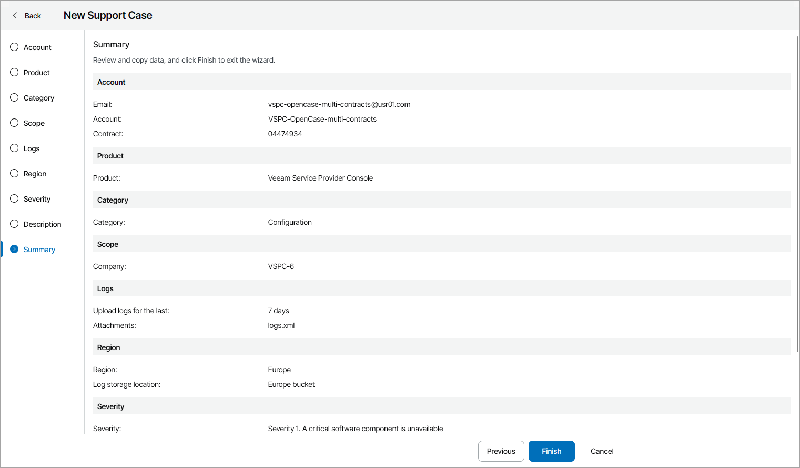

# Step 13. Review Support Case

At the Summary step of the wizard, review the support case configuration and click Finish.

After you create a support case, Veeam Service Provider Console will send the case details to the Veeam Customer Technical Support portal and open a support case under your Veeam Customer Technical Support account. Veeam Service Provider Console will synchronize the support case status every 15 minutes. If necessary, you can synchronize created support cases manually. To do that, at the top of the open cases list, click Refresh Data.

In Veeam Service Provider Console, you can monitor the case status and view the case details and logs uploading status. To perform additional actions on the support case, for example, attach new files or write a message to Veeam Customer Technical Support, you must refer to the [Veeam Customer Support Portal](https://www.veeam.com/support.html).

