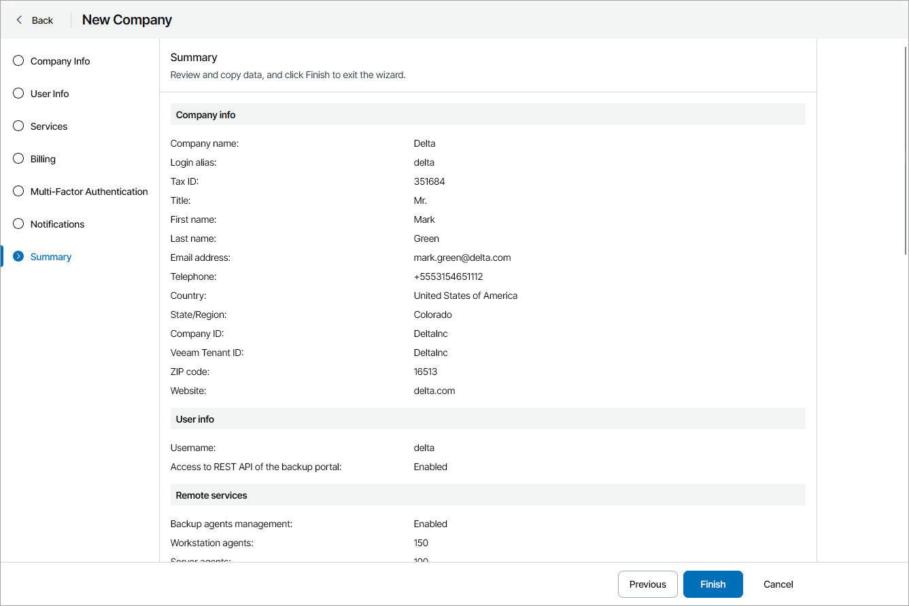

# Step 8. Review Settings

At the Summary step of the wizard, review the company account settings.

1. To send a welcome email message to the company, select the Send welcome email notification to the client when I click Finish check box.

The welcome email message will be sent to the email address specified at the [Company Info](specify_company_details.md) step of the wizard.

The message contains a link to Veeam Service Provider Console portal, user name and password that company users can use to access the Client Portal, as well as brief instructions on getting started with Veeam Service Provider Console. For details on the welcome email message, see [Sending Welcome Email Message](send_welcome_email.md).

1. Click Finish.

