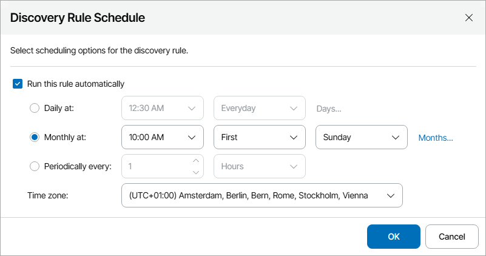

# Running Discovery

To run discovery manually:

1. Log in to Veeam Service Provider Console.

For details, see [Accessing Veeam Service Provider Console](access_vac.md).

1. In the menu on the left, click Discovery > Discovered Computers > Rules.
2. Select one or more discovery rules in the list.
3. At the top of the discovery rules list, click Run.

Alternatively, you can right-click the necessary discovery rule and choose Run.

1. Wait until the discovery rule state changes its value from Running to Success.

Scheduling Discovery

Instead of running discovery manually, you can configure a schedule according to which discovery must be performed. In this case, discovery will run with a specified periodicity. If new computers complying with a discovery rule appear in the client or hosted network, Veeam Service Provider Console will add them to the list of discovered computers (and optionally, install Veeam backup agents and assign a backup policy, if the discovery rule is configured to perform these tasks).

To schedule automatic discovery:

1. Log in to Veeam Service Provider Console.

For details, see [Accessing Veeam Service Provider Console](access_vac.md).

1. In the menu on the left, click Discovery > Discovered Computers > Rules.
2. Select the necessary discovery rule in the list.
3. At the top of the discovery rules list, click Schedule.

Alternatively, you can right-click the necessary discovery rule and choose Schedule.

1. In the Discovery Rule Schedule window, select the Run this rule automatically check box, if you want to enable scheduling for the discovery rule.

1. Define scheduling settings:

* To run discovery at specific time daily, on defined week days or with specific periodicity, select the Daily at option. Use the fields on the right to configure the necessary schedule.
* To run discovery once a month on specific days, select the Monthly at option. Use the fields on the right to configure the necessary schedule.
* To run discovery repeatedly throughout a day with a specific time interval, select the Periodically every option. In the field on the right, select the necessary time unit: Days, Hours or Minutes.

* To run discovery continuously, select the Periodically every option and choose Continuously from the list on the right. A new discovery session will start as soon as the previous discovery session finishes.

1. From the Time zone drop-down list, select the time zone in which daily and monthly schedule must be run.

1. Click Apply.

