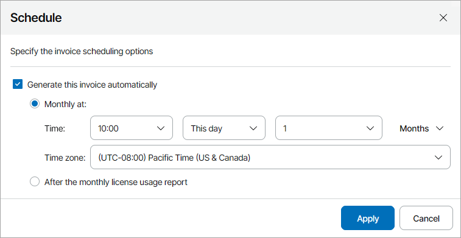

# Scheduling Invoices

You can configure a schedule according to which Veeam Service Provider Console must generate invoices. Scheduling can be used to automate the process of generating invoices on a regular basis.

Before you schedule invoices, make sure you completed prerequisites described in section [Configuring Invoice Appearance and Billing Notifications](configure_notifications_invoices.md).

Required Privileges

To perform this task, a user must have one of the following roles assigned: Portal Administrator, Site Administrator, Portal Operator.

Scheduling Invoices

To create a schedule according to which invoices must be generated:

1. Log in to Veeam Service Provider Console.

For details, see [Accessing Veeam Service Provider Console](access_vac.md).

1. In the menu on the left, click Invoices.
2. Open the Configurations tab.
3. Select the necessary companies in the list.
4. At the top of the list, click Schedule.

Alternatively, you can right-click the necessary company and choose Schedule.

1. In the Schedule window, select the Generate this invoice automatically check box and specify invoice schedule:

* To generate invoices once a month at a specific day, select Monthly at this time. Use the fields below to configure the necessary schedule.
* To generate invoices after the license usage report is generated, select After the monthly license usage report.

1. Click Apply.

Veeam Service Provider Console will enable the schedule immediately after you save scheduling settings. At the specified date and time, Veeam Service Provider Console will generate an invoice. You can view the generated invoice in the list of invoices. For details, see [Viewing and Downloading Invoice Details](export_invoice_details.md).

Disabling Invoice Schedule

To prevent Veeam Service Provider Console from generating invoices on a regular basis, you can disable a schedule. When an invoice schedule is disabled, you can only generate invoices manually.

To disable a previously configured invoice schedule for one or more companies:

1. Log in to Veeam Service Provider Console.

For details, see [Accessing Veeam Service Provider Console](access_vac.md).

1. In the menu on the left, click Invoices.
2. Open the Configurations tab.
3. Select the necessary companies in the list.
4. At the top of the list, click Schedule.

Alternatively, you can right-click the necessary invoice and choose Schedule.

1. In the Schedule window, clear the Generate this invoice automatically check box.
2. Click Apply.

