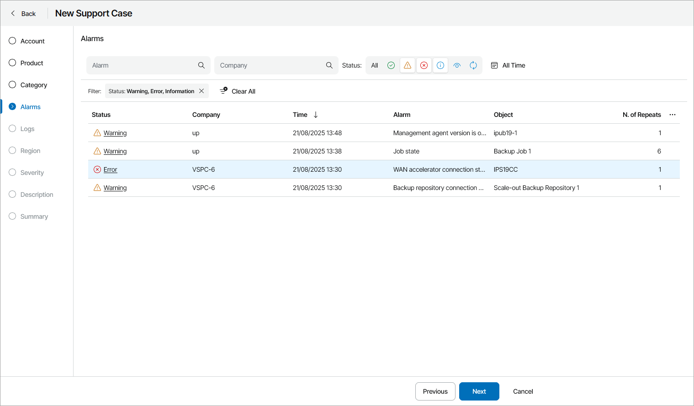

# Step 6. Select Alarm

The Alarms step of the wizard is available if at the [Category](select_category.md) step you have chosen to create a support case based on an alarm triggered in Veeam Service Provider Console.

In the list of all alarms triggered in Veeam Service Provider Console, select an alarm for which you want to create a support case.

To narrow down the list of alarms, you can apply the following filters:

* Alarm — search triggered alarms by name.
* Company — search alarms by the name of the company for which the alarms were triggered.
* Status — limit the list of alarms by the alarm status (Resolved, Warning, Error, Information, Acknowledged, Processing).
* Time Period — limit the list of alarms by the time when alarms were triggered.

