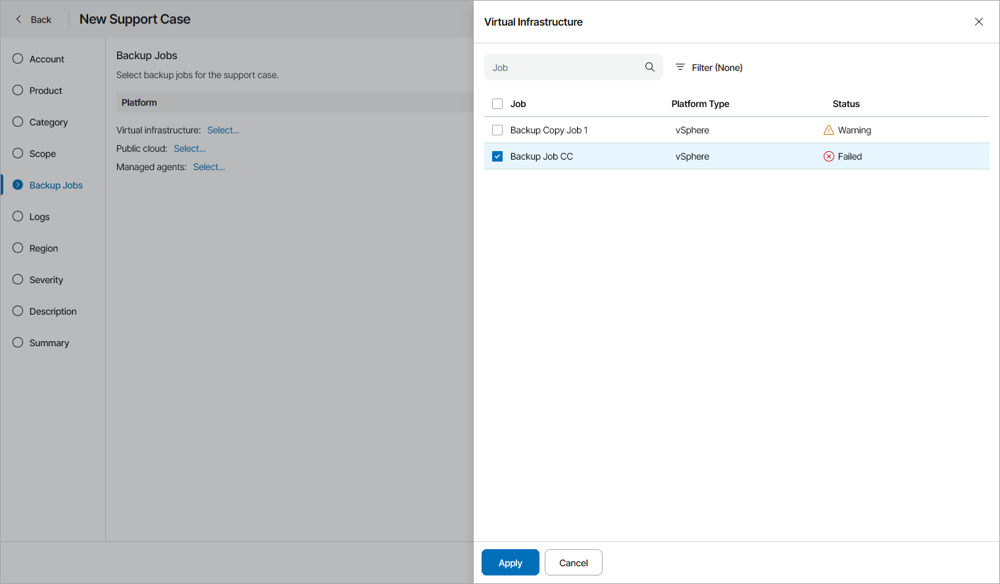

# Step 8. Select Backup Jobs or Policies

The Backup Jobs or Backup Policies step of the wizard is available if at the [Category](select_category.md) step you have chosen to create a support case for a backup job or cloud backup policy.

Select backup jobs or policies for the support case:

1. Click a link next to the necessary job or policy type.

[For Veeam Backup & Replication jobs] If you want to include in the support case an object storage job, select the Virtual Infrastructure platform type.

1. In the side window, select one or more backup jobs or policies to include in the support case.

Note that Veeam Service Provider Console will collect logs only from selected jobs or policies.

1. [For Veeam Backup & Replication] Repeat steps 1–2 for all backup jobs or policies you want to include in the support case.

