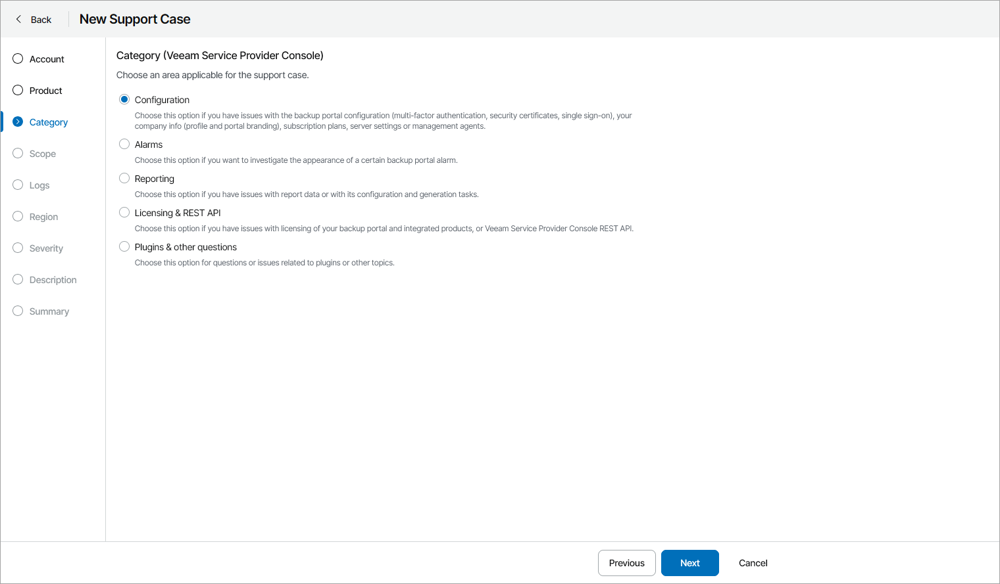

# Step 4. Select Support Case Category

At the Category step of the wizard, select category for the support case.

Depending on the product for which you want to create a support case, you can select one of the following categories:

* Configuration/Configuration & restore tasks — select this option if you have a configuration issue with managed Veeam product or an issue with Veeam Backup & Replication, Veeam backup agent or Veeam Backup for Microsoft 365 restore task.

If you select this category, you will pass to the [Scope](specify_case_scope.md) step of the wizard.

* [For Veeam Service Provider Console] Alarms — select this option if you have an issue based on an alarm triggered in Veeam Service Provider Console.

If you select this category, you will pass to the [Alarms](select_alarm.md) step of the wizard.

* [For Veeam Service Provider Console] Reporting — select this option if you have an issue based on a report generated in Veeam Service Provider Console.

If you select this category, you will pass to the [Reports](select_report.md) step of the wizard.

* Licensing/Licensing & REST API — select this option if you have a licensing issue with managed Veeam product or a Veeam Service Provider Console REST API issue.

If you select this category, you will pass to the [Scope](specify_case_scope.md) step of the wizard.

* Backup jobs/Backup policies — select this option if you have an issue with Veeam Backup & Replication, Veeam backup agent or Veeam Backup for Microsoft 365 backup job, or Veeam Backup for Public Clouds backup policy.

If you select this category, you will pass to the [Scope](specify_case_scope.md) step of the wizard and the wizard will include an additional Backup Jobs/Backup Policies step.

* Other questions/Plugins & other questions — select this option if you have an issue with Veeam Service Provider Console plugins, an issue with Veeam product that cannot be managed in Veeam Service Provider Console, or an issue that does not belong to any other category.

If you select this category, you will pass to the [Logs](upload_logs.md) step of the wizard.

