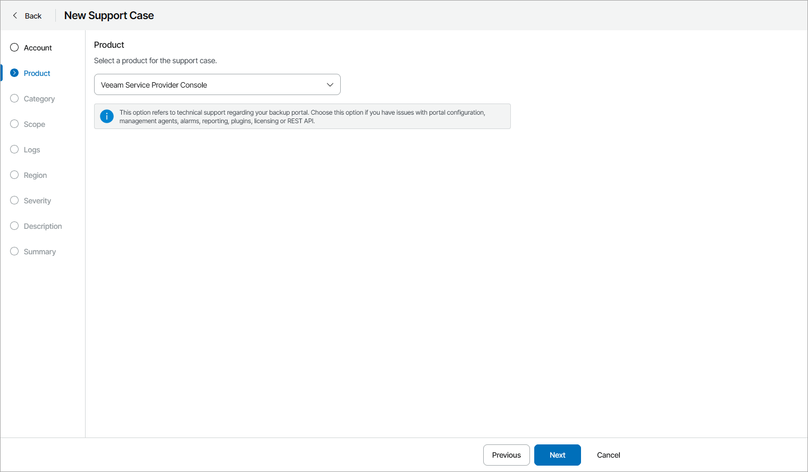

# Step 3. Select Product

At the Product step of the wizard, select a Veeam product for which you want to open a support case.

Note that you can open a support case only for a product included in your Veeam Customer Technical Support contract.

