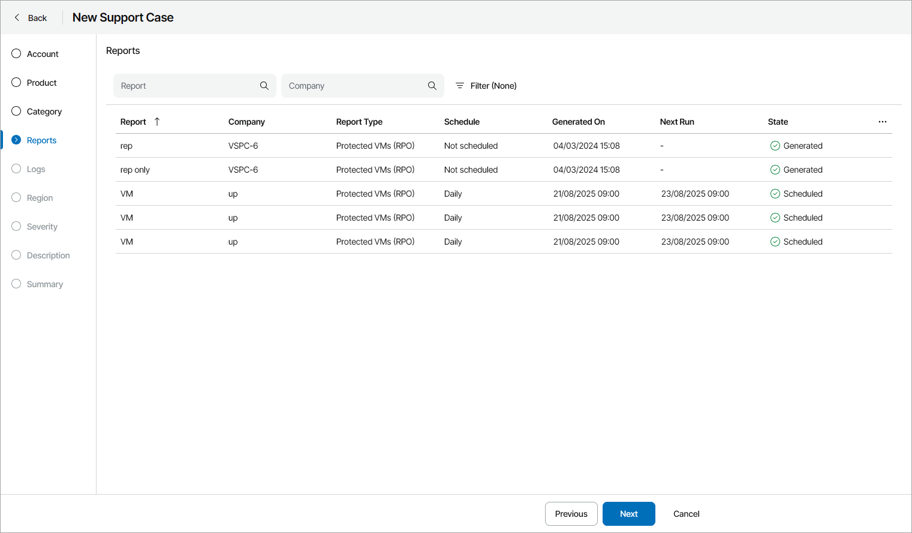

# Step 7. Select Report

The Reports step of the wizard is available if at the [Category](select_category.md) step you have chosen to create a support case based on a Veeam Service Provider Console report.

In the list of generated reports, select a report for which you want to create a support case.

To narrow down the list of reports, you can use the following filters:

* Report — search backup reports by report configuration name.

* Company — search backup reports by the name of the company for which the report was created.

* Type — limit the list of reports by type (All, Protected VMs (RPO & SLA), Protected data backup (RPO), Protected computers (RPO), Protected databases (RPO), Microsoft 365 object backup (SLA)).
* Managed by — limit the list of report by the type of user who created the report configuration (All, My company, Reseller).
* Report configuration — limit the list of reports by configuration type (All, Individual report, Summary report).

