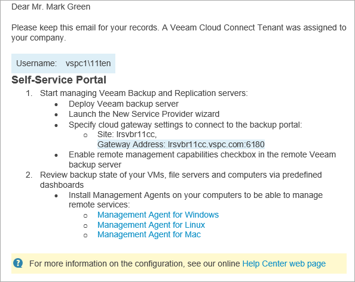

# Sending Welcome Email Message

After you create a new cloud tenant and map it to a Veeam Service Provider Console company, you can send a welcome email message to users in this company.

The email message contains:

* Username of the Company Tenant.
* Link to the Veeam Service Provider Console portal.
* Brief instructions on getting started with Veeam Service Provider Console.

The following image illustrates how a welcome email message looks.

Before You Begin

Before you send a welcome email message, complete the following prerequisites:

1. [Fill in the company profile](fill_company_profile.md).

Specify your company name and contact details in the company profile. This information will be displayed in the footer of the welcome email message. The email address that you specify in the company profile will be displayed in the From field of the welcome email message.

1. [Customize portal branding](customize_branding.md).

Upload a custom report logo and check the portal web address. The report logo will be displayed in the footer of the welcome email message. The web address will be included in the body, and displayed in the footer of the welcome email message.

1. [Configure SMTP server settings](configure_email_settings.md#smtpServer).

Specify settings of an SMTP server that will be used to send email notifications.

Sending Welcome Email Message to Cloud Tenants

To send a welcome email message to one or more mapped companies:

1. Log in to Veeam Service Provider Console.

For details, see [Accessing Veeam Service Provider Console](access_vac.md).

1. At the top right corner of the Veeam Service Provider Console window, click Configuration.
2. In the configuration menu on the left, click Catalog.
3. Click the Veeam Cloud Connect plugin tile.
4. In the menu on the left, click Tenants.
5. Select one or more cloud tenants in the list.
6. At the top of the list, click Send Welcome Email.

Alternatively, you can right-click the necessary cloud tenant and select Send Welcome Email.

Veeam Service Provider Console will send an email message to the email address specified in the Company Info section of the mapped Veeam Service Provider Console company settings.

