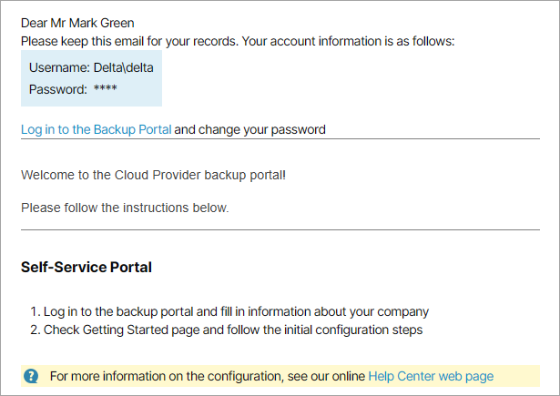

# Sending Welcome Email Message

When you create a new company, you can send a welcome email message to users in this company.

The email message contains:

* Credentials of the Company Owner for connecting to the service provider and accessing the Client Portal.
* Custom text specified at the [Notification](company_alarms.md) step.
* Link to the Veeam Service Provider Console portal.
* Brief instructions on getting started with Veeam Service Provider Console.

The following image illustrates how a welcome email message looks.

Before You Begin

Before you send a welcome email message, complete the following prerequisites:

1. [Fill in the company profile](fill_company_profile.md).

Specify your company name and contact details in the company profile. This information will be displayed in the footer of the welcome email message. The email address that you specify in the company profile will be displayed in the From field of the welcome email message.

1. [Customize portal branding](customize_branding.md).

Upload a custom report logo and check the portal web address. The report logo will be displayed in the footer of the welcome email message. The web address will be included in the body, and displayed in the footer of the welcome email message.

1. [Configure SMTP server settings](configure_email_settings.md#smtpServer).

Specify settings of an SMTP server that will be used to send email notifications.

Required Privileges

To perform this task, a user must have one of the following roles assigned: Portal Administrator, Site Administrator, Portal Operator.

Sending Welcome Email Message to New Companies

You can send a welcome email message when you create a new company:

1. Launch the New Company wizard and specify company settings.

For details, see [Creating Companies](create_companies.md).

1. At the Company Info step of the wizard, in the Email Address field, specify an address to which the welcome email message must be sent.
2. At the Notifications step of the wizard, customize a welcome email message as described in [Step 9. Configure Notification Settings](company_alarms.md).
3. At the Summary step of the wizard, select the Send welcome email notification to the client when I click Finish check box.
4. Click Finish.

Veeam Service Provider Console will send a welcome email message to the email address specified in the Company Info section of the company settings.

Sending Welcome Email Message to Existing Companies

You can send a welcome email message to already existing companies.

|  |
| --- |
| Note: |
| An email message sent to an existing company does not include the password of the Company Owner. Only the Company Owner user name is included in the email body. |

To send a welcome email message to one or more existing companies:

1. Log in to Veeam Service Provider Console.

For details, see [Accessing Veeam Service Provider Console](access_vac.md).

1. In the menu on the left, click Companies.
2. Select one or more companies in the list.
3. At the top of the list, click Manage > Send Welcome Email.

Alternatively, you can right-click the necessary company, choose Manage and select Send Welcome Email.

Veeam Service Provider Console will send an email message to the email address specified in the Company Info section of the company settings.

