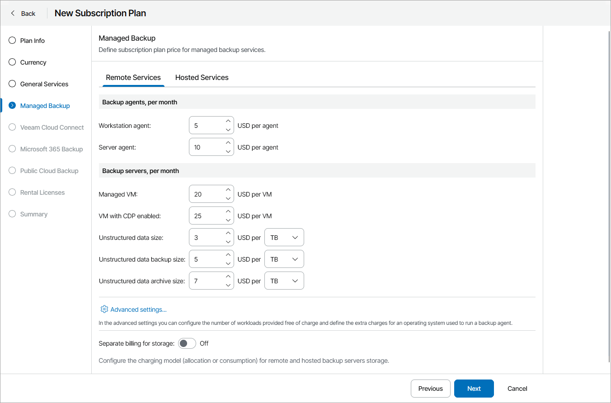
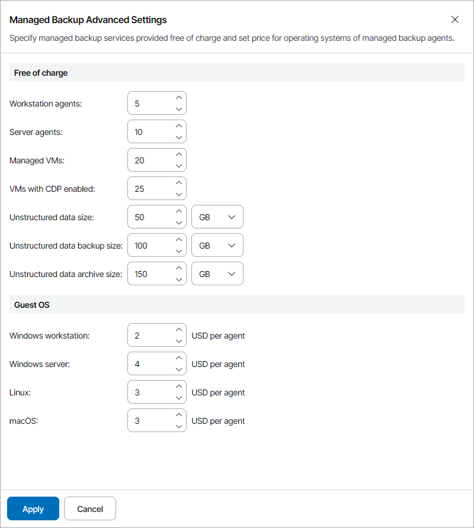
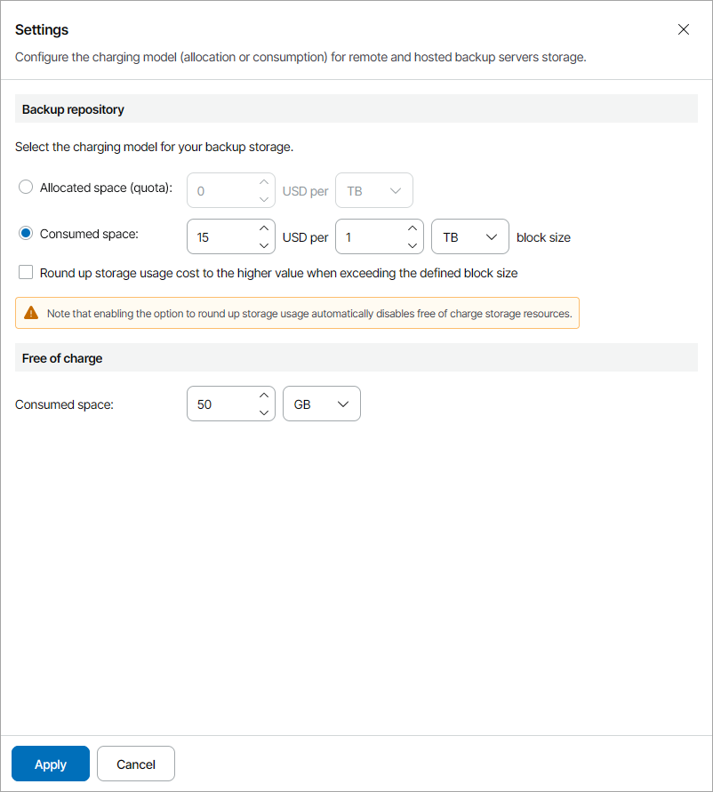

# Step 5. Specify Rates for Managed Backup Services

At the Managed Backup step of the wizard, on the Remote Services and Hosted Services tabs, specify charge rates for managed backup services:

* In the Workstation agent field, specify a charge rate for a managed workstation agent.
* In the Server agent field, specify a charge rate for a managed server agent.
* In the Managed VM field, specify a charge rate for a managed VM.
* In the VM with CDP enabled field, specify a charge rate for a managed VM protected with a CDP policy.

* In the Unstructured data size field, specify a charge rate for managing one GB or TB of file share or object storage data at source.
* In the Unstructured data backup size field, specify a charge rate for managing one GB or TB of file share or object storage data backups.
* In the Unstructured data archive size field, specify a charge rate for managing one GB or TB of file share or object storage data backups in the archive repository.

If you do not want to charge for a specific service, do not specify a charge rate for it (leave the field blank). If no rate is specified for a service, Veeam Service Provider Console will not take this service into account when calculating the total payment.

For details on chargeable services, see [Services](services.md#vbr).

For each type of provided services, you can specify the number of workloads and data storage that will be managed free of charge and additional charges for the guest OSes of computers that run Veeam backup agents:

1. On the required services tab, click Advanced settings.
2. In the Free of charge section, specify the number of workloads for which you will not apply charges.
3. In the Guest operating systems section, specify extra charges for guest OSes of managed Veeam backup agents.
4. Click Apply.

Configuring Charging Model

For each type of provided services, you can select a charging model for the backup storage:

1. Under the required services tab, set the Separate billing for storage toggle to On.
2. Click Configure.
3. In the Settings window, specify the charging model for the backup repository storage:

* Allocated space (quota) — select this option to charge for storage space allocated to a company and specify a charge rate for one GB or TB of backup storage space.
* Consumed space — select this option to charge for consumed storage space and specify the size of a storage space block in GB or TB and a charge rate for one block.

You can select the Round up storage usage cost to the higher value when exceeding the defined block size check box to round up storage usage costs. For example, if you configured block size of 10 GB and the client company used 13 GB of repository storage space, the company will be charged for 20 GB of storage space.

Note that if you round up storage usage costs, free of charge storage resources will be disabled automatically.

If you do not want to charge for a specific service, do not specify a charge rate for it (leave the field blank). If no rate is specified for a service, Veeam Service Provider Console will not take this service into account when calculating the total payment.

For a description of chargeable services, see [Services](services.md#vbo).

1. If you have selected to charge for consumed space, in the Free of charge section, you can specify the amount of backup and archive storage space for which you will not apply charges.

