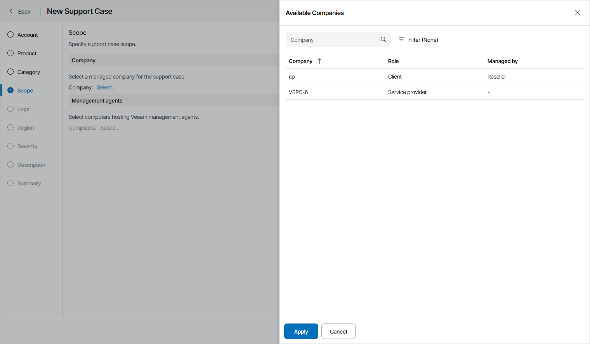

# Step 5. Specify Support Case Scope

The Scope step of the wizard is available if at the [Category](select_category.md) step you have chosen to create a support case based on configuration, licensing or backup job\policy issue with Veeam Service Provider Console or a product managed in Veeam Service Provider Console.

Specify company and managed object for a support case:

1. Click a link in the Company section to open the Available Companies window.
2. In the Available Companies window, select a company for which you want to open a support case.
3. Click a link in the managed objects section and select one or more objects for which you want to open a support case.

Note that Veeam Service Provider Console will collect logs only from selected objects.

