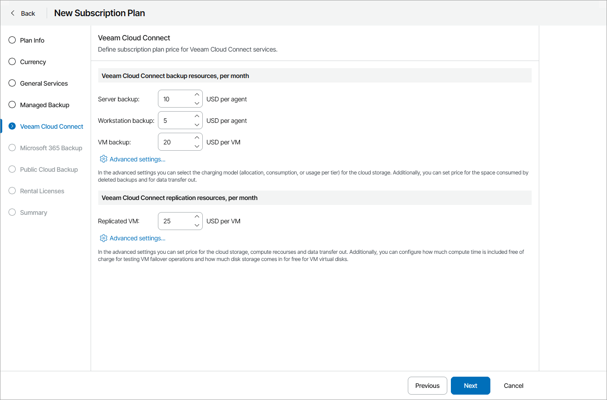
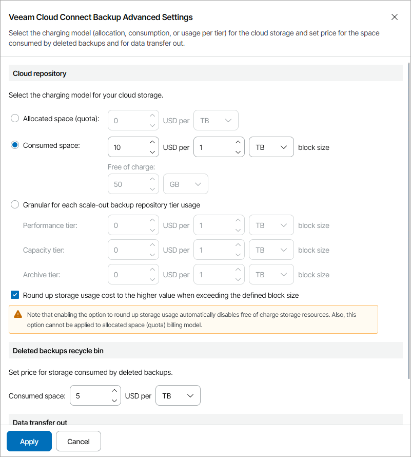
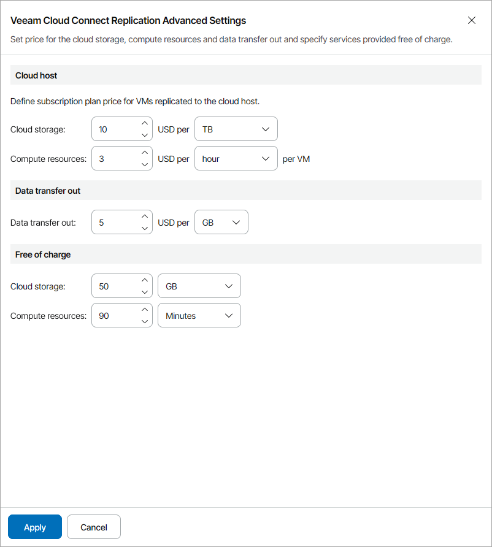

# Step 6. Specify Rates for Cloud Connect Services

At the Veeam Cloud Connect step of the wizard, specify charge rates for storing backups in cloud repositories:

* In the Server backup field, specify a charge rate for storing backup data of one server computer on a cloud repository, per month.
* In the Workstation backup field, specify a charge rate for storing backup data for one workstation computer on a cloud repository, per month.
* In the VM backup field, specify a charge rate for storing one VM in backup on a cloud repository, per month.

To specify charge rates for resources consumed by cloud VM backups, see [Configuring Cloud Backup Advanced Settings](#backup).

* In the Replicated VM field, specify a charge rate for one VM replica registered on a cloud host, per month.

To specify charge rates for resources consumed by cloud VM replicas, see [Configuring Cloud Replication Advanced Settings](#replica).

If you do not want to charge for a specific service, do not specify a charge rate for it (leave the field blank). If no rate is specified for a service, Veeam Service Provider Console will not take this service into account when calculating the total payment.

For description of chargeable services, see [Services](services.md#cloud).

Configuring Cloud Backup Advanced Settings

You can select the charging model for the cloud storage space and specify charges for cloud backups stored in the recycle bin:

1. In the Veeam Cloud Connect backup resources, per month section, click Advanced settings.
2. In the Cloud repository section, configure how you want to apply charges for cloud repository usage:

* Allocated space (quota) — select this option to charge for storage space allocated to a company and specify a charge rate for one GB or TB of cloud storage space.
* Consumed space — select this option to charge for consumed storage space on a cloud repository and specify the size of a cloud storage space block in GB or TB and a charge rate for one block.

To provide a specific amount of storage space that can be consumed by backup files for free, in the Free of charge field specify for what amount of storage space you will not apply charges.

* Granular for each scale-out backup repository tier usage — select this option to charge separately for storage space consumed on different tiers of scale-out backup repositories and specify the size of a cloud storage space block in GB or TB and a charge rate for one block on each tier.

For details on scale-out backup repository tiers, see section [Scale-Out Backup Repositories](https://helpcenter.veeam.com/docs/vbr/userguide/backup_repository_sobr.html?ver=13) of the Veeam Backup & Replication User Guide.

If you have selected to charge for consumed space or granularly, you can round up storage usage costs for blocks that exceed the defined block size. For example, if you configured block size of 10 GB and the client company used 13 GB of repository storage space, the company will be charged for 20 GB of storage space.

To round up usage cost, select the Round up storage usage cost to the higher value when exceeding the defined block size check box.

Note that if you round up storage usage costs, free of charge storage resources will be disabled automatically.

1. In the Deleted backups recycle bin section, specify a charge rate for one GB or TB of data consumed by backups deleted from a cloud repository.

For details on storing deleted backup files in the recycle bin, see section [Insider Protection](https://helpcenter.veeam.com/docs/backup/cloud/cloud_connect_bin.html) of the Veeam Cloud Connect Guide.

1. In the Data transfer out section, specify a charge rate for one GB or TB of data downloaded from a cloud repository.
2. Click Apply.

Configuring Cloud Replication Advanced Settings

You can specify charge rates for resources consumed by cloud VM replicas and compute resources free of charge:

1. In the Veeam Cloud Connect replication resources, per month section, click Advanced settings.
2. In the Cloud host section, specify the following:

* In the Cloud storage field, specify a charge rate for one GB or TB of cloud storage space consumed by VM replica files.
* In the Compute resources field, specify a charge rate for one minute, hour, day, week or month of using CPU and memory resources by a VM on a cloud host.

1. In the Data transfer out section, specify a charge rate for one GB or TB of VM replica data downloaded from cloud storage.
2. In the Free of charge section, specify the following:

* In the Cloud storage field, specify for what amount of storage space consumed by VM replicas you will not apply charges.
* In the Compute resources field, specify a period during which VM replicas can consume CPU and memory resources on a cloud host for free.

1. Click Apply.

