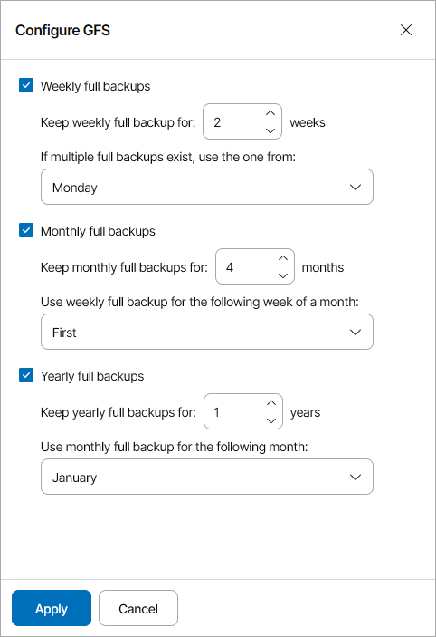
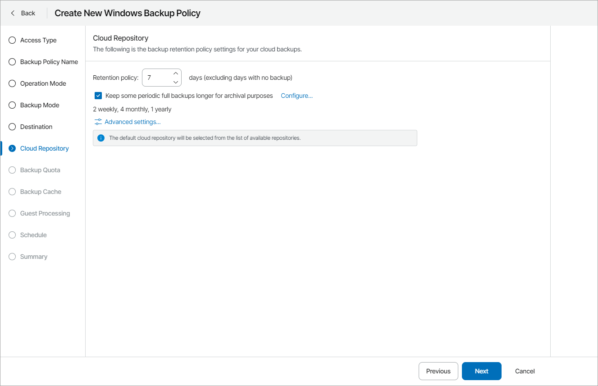

# Step 13. Specify Cloud Backup Settings

The Cloud Repository step of the wizard is available if at the [Destination](choose_backup_destination.md) step you have chosen to save backup files on a Veeam Cloud Connect repository.

1. Specify backup retention policy settings:

* In the Retention policy field, specify the number of days for which you want to store backup files in the target location. By default, Veeam backup agent keeps backup files for 7 days. After this period is over, Veeam backup agent will remove the earliest restore points from the backup chain.

For details, see section [Short-Term Retention Policy](https://helpcenter.veeam.com/docs/agentforwindows/userguide/retention.html) of the Veeam Agent for Microsoft Windows User Guide.

* To enable long-term retention policy, select the Keep some periodic full backups longer for archival purposes check box and click Configure.

In the Configure GFS window, specify how long you want to keep weekly, monthly and yearly full backups.

For details on GFS retention mechanism, see section [Long-Term Retention Policy (GFS)](https://helpcenter.veeam.com/docs/vbr/userguide/gfs_retention_policy.html?ver=13) of the Veeam Backup & Replication User Guide.

|  |
| --- |
| Note: |
| * To enable GFS retention policy, you must configure creation of synthetic or active full backups in the [Advanced Settings](specify_advanced_job_settings.md). * GFS retention settings are available for Veeam Agent for Microsoft Windows version 5 or later. |

1. Click Advanced Settings to specify advanced settings for the backup job.

For details, see [Specify Advanced Job Settings](specify_advanced_job_settings.md).

|  |
| --- |
| Note: |
| The policy will target to the default repository specified in the company settings. For details on how to change the default repository, see [Allocating Cloud Backup Resources](allocate_cloud_backup_resources.md). If you want to store backups on another backup repository, you can choose this repository in backup job settings for specific computers. For details, see [Configuring Backup Job Settings for Individual Computers](change_backup_job_settings.md). |

