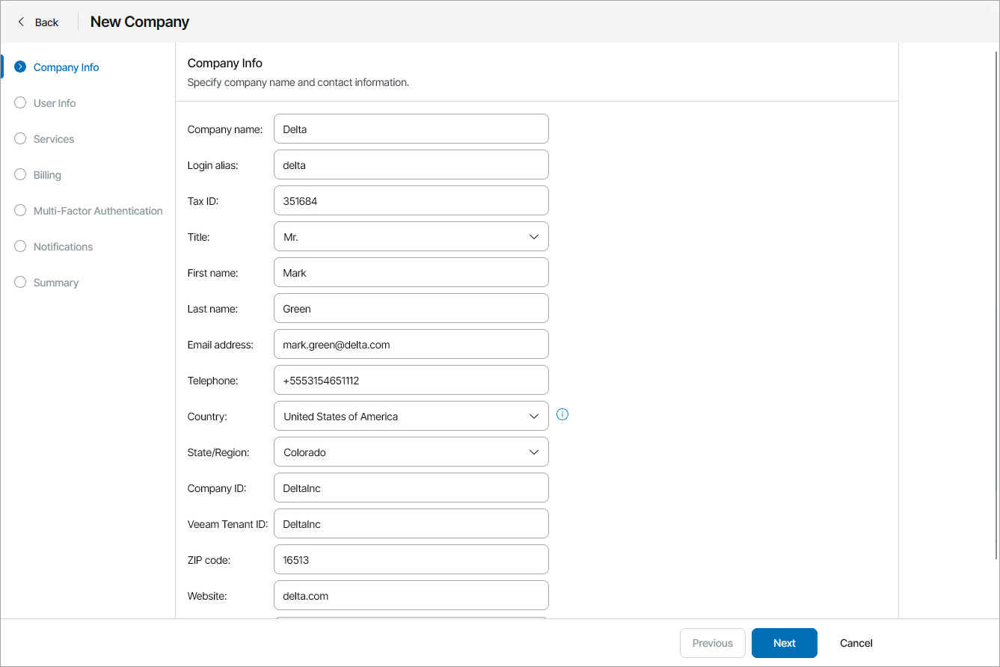

# Step 2. Specify Company Details

At the Company Info step of the wizard, specify general company details:

1. In the Company name field, specify a company name.
2. In the Login alias field, specify a short name for login to the backup portal.
3. In the Tax ID field, type the company tax identification number.
4. In the Title field, choose how to address a contact person in a company (Mr., Miss, Mrs., Ms.).
5. In the First name and Last name fields, specify the first and last names of a contact person in a company.
6. In the Email address field, specify a contact email address.

The email address will be used to send the client email notifications, such as a welcome email and alarm notifications.

1. In the Telephone field, specify a contact phone number.
2. In the Country list, choose a country where the company is located.
3. In the State/Region list, choose a region where the company is located.
4. In the Company ID field, type a company ID that will be used for integrating Veeam Service Provider Console with 3rd party systems.

You can specify an ID that is assigned to the company in a 3rd party system, and synchronize company data between this 3rd party system and Veeam Service Provider Console through data export/import, using this ID.

1. In the Veeam Tenant ID field, type a tenant ID that will be used for integrating Veeam Service Provider Console with VCSP Pulse.

This field is used for integrating Veeam Service Provider Console with VCSP Pulse. If you have configured VCSP Pulse integration, this field will be inactive. Tenant ID will be obtained automatically after you configure VCSP Pulse company mapping.

1. In the ZIP Code field, specify a postal code.
2. In the Website field, specify the URL of a company website.
3. In the Additional notes field, type any additional details or comments.

The following information is displayed in invoices:

* Specified company name
* First and last name of the contact person
* ZIP code
* Country and state
* Phone number
* Tax ID
* Company ID

The specified country and region will be used to display the company on the Companies State by Region map on the Overview dashboard. For details, see [Overview](overview.md).

