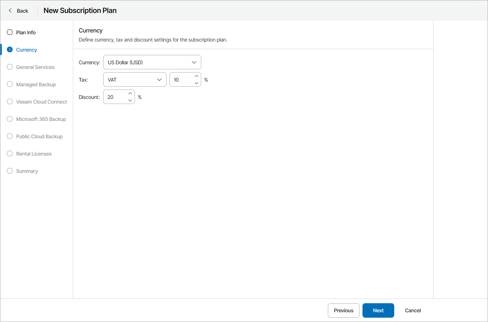

# Step 3. Specify Currency, Tax and Discount

At the Currency step of the wizard, specify the following settings:

1. In the Currency list, choose the payment currency.
2. From the Tax list, select a type of tax (VAT, GST, Sales Tax) and specify a tax rate.
3. [Optional] In the Discount field, specify a discount rate.

For details on how the cost of provided services is calculated, see [How Cost of Services is Calculated](how_service_cost_calculated.md).

