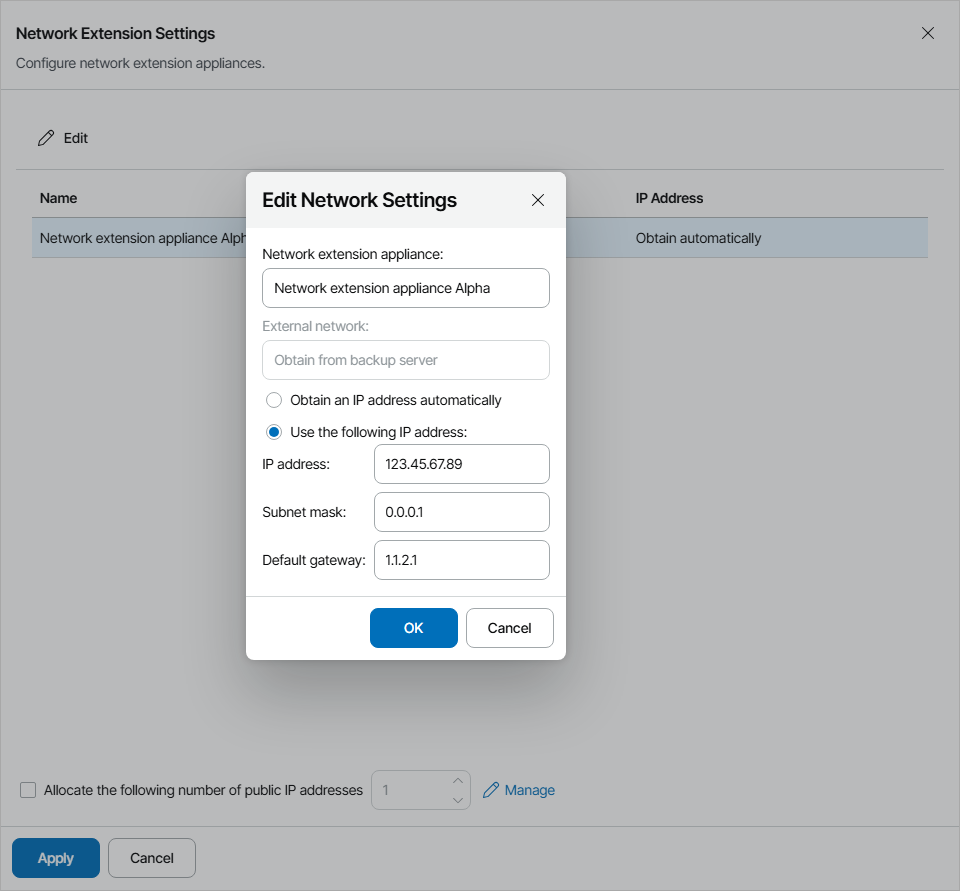
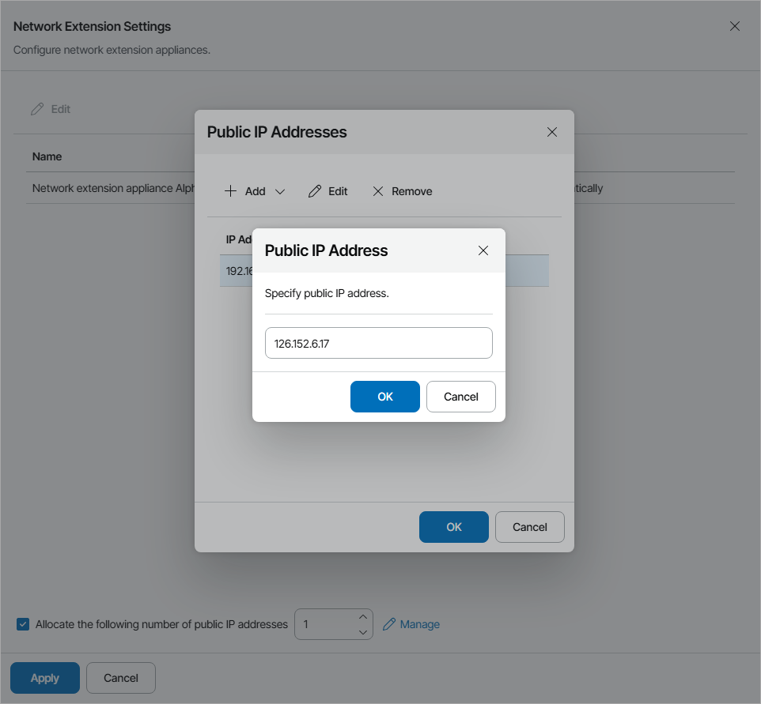

# Configuring Network Extension Settings

In the Network extension settings window, you can specify network settings for the network extension appliance that Veeam Cloud Connect will deploy on the provider side.

Veeam Cloud Connect deploys the network extension appliance:

* [For the Native Veeam Cloud Connect tenant accounts] On the virtualization host that provides resources for the hardware plan to which the cloud tenant is subscribed.
* [For the VMware Cloud Director tenant accounts] In the Organization vDC specified as a target for tenant VM replicas.

VM replicas on the cloud host use the provider network extension appliance:

* To communicate with VMs in the production site after partial site failover
* To communicate with the Internet after full site failover

You can configure a network adapter (vNIC) on the network extension appliance. This network adapter connects the network extension appliance to the external network where the provider backup infrastructure components reside. For details, see section [Network Extension Appliance](https://helpcenter.veeam.com/docs/backup/cloud/cloud_network_extension_appliance.html) of the Veeam Cloud Connect Guide.

To configure network extension settings:

1. Select the network extension appliance in the list and click Edit.
2. In the Network extension appliance field, check and if necessary modify the name for the network extension appliance.
3. Specify IP addressing settings for the network extension appliance:

* If you use a DHCP server in the production network, leave the Obtain an IP address automatically option selected.

In this case, the IP address to the network extension appliance will be assigned automatically.

* To assign an IP address manually, select the Use the following IP address option and specify the IP address, subnet mask and default gateway address.

1. Click OK.
2. If VM replicas must be accessible from the Internet after full site failover, select the Allocate the following number of public IP addresses option and specify the number of public IP addresses.

Veeam Backup & Replication will assign to the cloud tenant the specified number of IP addresses from the reserved pool. A backup administrator on the cloud tenant side can map a public IP address to a VM replica during cloud failover plan configuration. For details, see section [Specify Public IP Addressing Rules](https://helpcenter.veeam.com/docs/backup/cloud/cloud_failover_plan_public_ip.html) of the Veeam Cloud Connect Guide.

1. [Optional] If you have not reserved in advance the necessary number of public IP addresses that can be assigned to VM replicas, click Manage at the bottom of the window to add one or several IP addresses to the pool of available public IP addresses. For details, see [Managing Public IP Addresses](specify_extension_settings.md#ip).

Managing Public IP Addresses

It may be required that one or several VM replicas are accessible from the Internet after full site failover. To make this possible, all cloud VM replicas that need to be accessed from the Internet must have a public IP address.

In your network infrastructure, you can allocate a pool of public IP addresses and provide one or several public IP addresses from this pool to the cloud tenant. The cloud tenant can specify public IP addressing settings in the process of cloud failover plan configuration.

When the cloud tenant's production VM fails over to its replica on the cloud host during full site failover, Veeam Backup & Replication will assign the specified public IP address to the network extension appliance on the provider side. The network extension appliance will redirect traffic from this public IP address to the IP address of a VM replica in the internal VM replica network. As a result, a VM replica on the cloud host will be accessible from the Internet.

|  |
| --- |
| Note: |
| * Allocation of public IP addresses is available for the Native Veeam Cloud Connect tenant accounts only. * To enable access to a cloud tenant VM replica by a public IP address, you must properly configure in the production network infrastructure port forwarding to the network extension appliance on the provider side. * It is recommended to plan network resource allocation and allocate public IP addresses in advance. |

To configure a pool of public IP addresses:

1. In the Network Extension Appliance window, click Manage.
2. Add IP addresses to the pool:

* To add to the pool several public IP addresses at a time, click Add and select Add IP Range. In the Public IP Address Range window, specify the first and the last IP address in the range of IP addresses you want to add to the pool.
* To add to the pool one public IP address, click Add and select Add Individual IP Address. In the Public IP Address window, specify the IP address you want to add to the pool.

1. Click OK.

