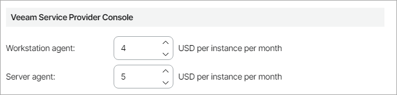
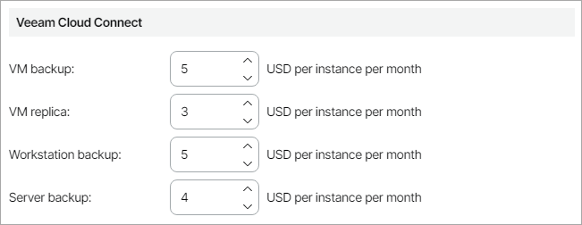
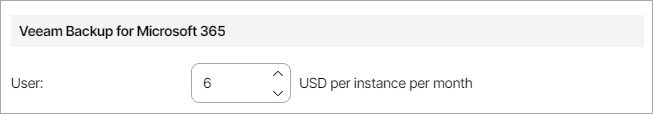
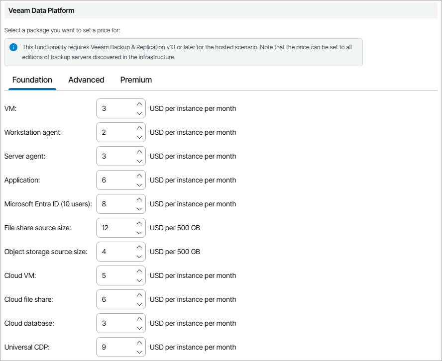
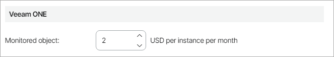
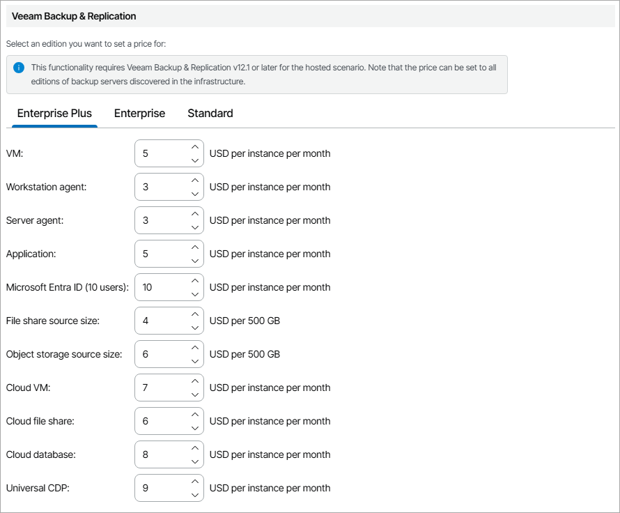

# Step 9. Specify Rates for Rental Licenses

At the Rental Licenses step of the wizard, you can specify charge rates for consumed license instances. Veeam Service Provider Console obtains the number of consumed licenses from the last generated license usage report. To make sure that the invoice will represent the correct number of consumed licenses, you can configure the invoice to generate after the monthly usage report is generated. For details on invoice scheduling configuration, see [Scheduling Invoices](schedule_invoices.md).

To specify charge rates for consumed license instances:

* In the Veeam Service Provider Console section, specify license charge rates for Veeam backup agents managed by Veeam Service Provider Console:

* In the Workstation agent field, provide a charge rate for a license instance consumed by Veeam backup agents in the Workstation mode.
* In the Server agent field, provide a charge rate for a license instance consumed by Veeam backup agents in the Server mode.

* In the Veeam Cloud Connect section, specify license charge rates for provided cloud backup services:

* In the VM backup field, provide a charge rate for a license instance consumed by VM backups created with Veeam Backup & Replication and stored on cloud repositories.
* In the VM replica field, provide a charge rate for a license instance consumed by VM replicas created with Veeam Backup & Replication and registered on cloud hosts.
* In the Workstation backup field, provide a charge rate for a license instance consumed by backups for computers that run Veeam backup agents in the Workstation mode and that are stored on cloud repositories.
* In the Server backup field, provide a charge rate for a license instance consumed by backups for computers that run Veeam backup agents in the Server mode and that are stored on cloud repositories.

* In the Veeam Backup for Microsoft 365 section, specify a charge rate for a license instance consumed by protected Microsoft 365 users.

* In the Veeam Data Platform section, specify license charge rates for provided backup services:

1. In the tab menu, select the necessary Veeam Data Platform package.

For details on features supported in different packages, see [Veeam Data Platform Feature Comparison](https://cdn.propartner.veeam.com/bin/veeam_VCSP_vbr_one_feature_comparison.pdf).

1. Configure license charge rates:

* In the VM field, provide a charge rate for a license instance consumed by Microsoft Hyper-V, VMware vSphere, Nutanix AHV and Red Hat Virtualization VMs protected by Veeam Backup & Replication with an installed Veeam Data Platform license.
* In the Workstation agent field, provide a charge rate for a license instance consumed by computers that run Veeam backup agents in the Workstation mode and that are managed by Veeam Backup & Replication with an installed Veeam Data Platform license.
* In the Server agent field, provide a charge rate for a license instance consumed by computers that run Veeam backup agents in the Server mode and that are managed by Veeam Backup & Replication with an installed Veeam Data Platform license.
* In the Application field, provide a charge rate for a license instance consumed by enterprise applications (SAP HANA, Oracle RMAN, SAP on Oracle) protected by Veeam Backup & Replication with an installed Veeam Data Platform license.
* In the Microsoft Entra ID (10 users) field, provide a charge rate for a license instance consumed by packs of 10 Microsoft Entra ID users protected by Veeam Backup & Replication with an installed Veeam Data Platform license.
* In the File share source size field, provide a charge rate for a license instance consumed by data blocks (500 GB each) of file shares protected by Veeam Backup & Replication with an installed Veeam Data Platform license.
* In the Object storage source size field, provide a charge rate for a license instance consumed by data blocks (500 GB each) of workloads backed up to object storage repositories.
* In the Cloud VM field, provide a charge rate for a license instance consumed by cloud VMs protected by Veeam Backup for Public Clouds appliances with an installed Veeam Data Platform license.
* In the Cloud file share field, provide a charge rate for a license instance consumed by cloud file shares protected by Veeam Backup for Public Clouds appliances with an installed Veeam Data Platform license.
* In the Cloud database field, provide a charge rate for a license instance consumed by cloud databases protected by Veeam Backup for Public Clouds appliances with an installed Veeam Data Platform license.
* In the Universal CDP field, provide a charge rate for a license instance consumed by workloads protected by Universal CDP policies.

1. Repeat steps a–b for each package that you want to charge for.

|  |
| --- |
| Note: |
| Charging for hosted Veeam Backup & Replication servers that provide backup resources to client companies is available only for hosted Veeam Backup & Replication servers version 13 or later with installed Veeam Data Platform licenses. |

* In the Veeam ONE section, specify a charge rate for a license instance consumed by monitored Veeam ONE workloads.

* In the Veeam Backup & Replication section, specify license charge rates for provided backup services:

1. In the tab menu, select the necessary Veeam Backup & Replication edition.

For details on features supported in different Veeam Backup & Replication editions, see [Veeam Data Platform Feature Comparison](https://cdn.propartner.veeam.com/bin/veeam_VCSP_vbr_one_feature_comparison.pdf).

1. Configure license charge rates:

* In the VM field, provide a charge rate for a license instance consumed by Microsoft Hyper-V, VMware vSphere, Nutanix AHV and Red Hat Virtualization VMs protected by Veeam Backup & Replication.
* In the Workstation agent field, provide a charge rate for a license instance consumed by computers that run Veeam backup agents in the Workstation mode and that are managed by Veeam Backup & Replication.
* In the Server agent field, provide a charge rate for a license instance consumed by computers that run Veeam backup agents in the Server mode and that are managed by Veeam Backup & Replication.
* In the Application field, provide a charge rate for a license instance consumed by enterprise applications (SAP HANA, Oracle RMAN, SAP on Oracle) protected by Veeam Backup & Replication.
* In the Microsoft Entra ID (10 users) field, provide a charge rate for a license instance consumed by packs of 10 Microsoft Entra ID users protected by Veeam Backup & Replication.
* In the File share source size field, provide a charge rate for a license instance consumed by data blocks (500 GB each) of file shares protected by Veeam Backup & Replication.
* In the Object storage source size field, provide a charge rate for a license instance consumed by data blocks (500 GB each) of workloads backed up to object storage repositories.
* In the Cloud VM field, provide a charge rate for a license instance consumed by cloud VMs protected by Veeam Backup for Public Clouds appliances.
* In the Cloud file share field, provide a charge rate for a license instance consumed by cloud file shares protected by Veeam Backup for Public Clouds appliances.
* In the Cloud database field, provide a charge rate for a license instance consumed by cloud databases protected by Veeam Backup for Public Clouds appliances.
* In the Universal CDP field, provide a charge rate for a license instance consumed by workloads protected by Universal CDP policies.

1. Repeat steps a–b for each Veeam Backup & Replication edition that you want to charge for.

|  |
| --- |
| Note: |
| Charging for hosted Veeam Backup & Replication servers that provide backup resources to client companies is available only for hosted Veeam Backup & Replication servers version 12.1 or later. |

