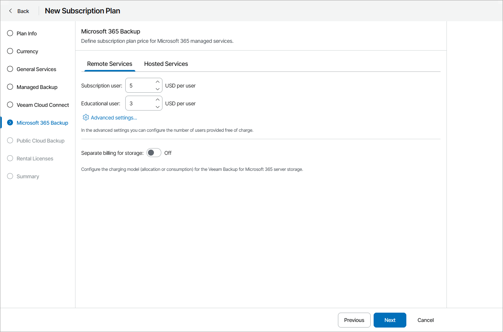
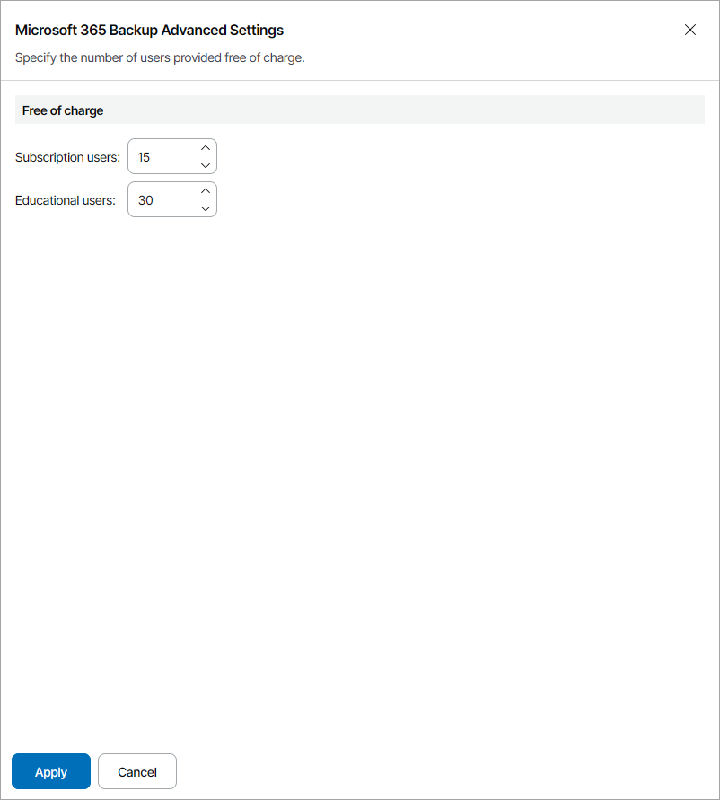
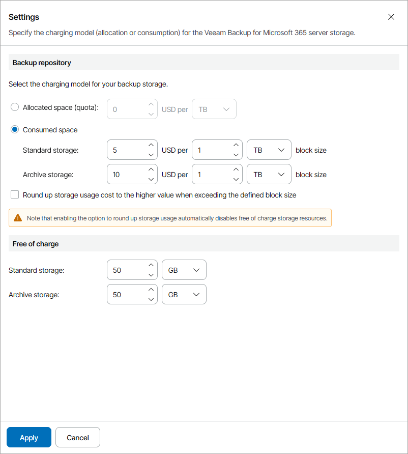

# Step 7. Specify Rates for Microsoft 365 Services

At the Microsoft 365 Backup step of the wizard, on the Remote Services and Hosted Services tabs, specify charge rates for managed Veeam Backup for Microsoft 365 services:

* In the Subscription user field, specify a charge rate for Microsoft 365 subscription users.
* In the Educational user field, specify a charge rate for users with Microsoft 365 Education licenses.

If you do not want to charge for a specific service, do not specify a charge rate for it (leave the field blank). If no rate is specified for a service, Veeam Service Provider Console will not take this service into account when calculating the total payment.

For details on chargeable services, see [Services](services.md#vbo).

For each type of provided services, you can specify the number of users that will be managed free of charge:

1. Under the required services tab, click Advanced settings.
2. In the Subscription users and Educational users fields, specify the number of users for which you will not apply charges.
3. Click Apply.

Configuring Charging Model

For each type of provided services, you can select a charging model for the backup storage:

1. On the required services tab, set the Separate billing for storage toggle to On.
2. Click Configure.
3. In the Settings window, specify the charging model for the Microsoft 365 repository storage:

* Allocated space (quota) — select this option to charge for storage space allocated to a company and specify a charge rate for one GB or TB of backup storage space.
* Consumed space — select this option to charge for consumed storage space and specify the size of a standard and archive storage space block in GB or TB and a charge rate for one block.

If you have selected to charge for consumed space, you can round up storage usage costs for blocks that exceed the defined block size. For example, if you configured block size of 10 GB and the client company used 13 GB of repository storage space, the company will be charged for 20 GB of storage space.

To round up usage cost, select the Round up storage usage cost to the higher value when exceeding the defined block size check box.

Note that if you round up storage usage costs, free of charge storage resources will be disabled automatically.

If you do not want to charge for a specific service, do not specify a charge rate for it (leave the field blank). If no rate is specified for a service, Veeam Service Provider Console will not take this service into account when calculating the total payment.

For a description of chargeable services, see [Services](services.md#vbo).

1. If you have selected to charge for consumed space, in the Free of charge section, you can specify the amount of backup and archive storage space for which you will not apply charges.

