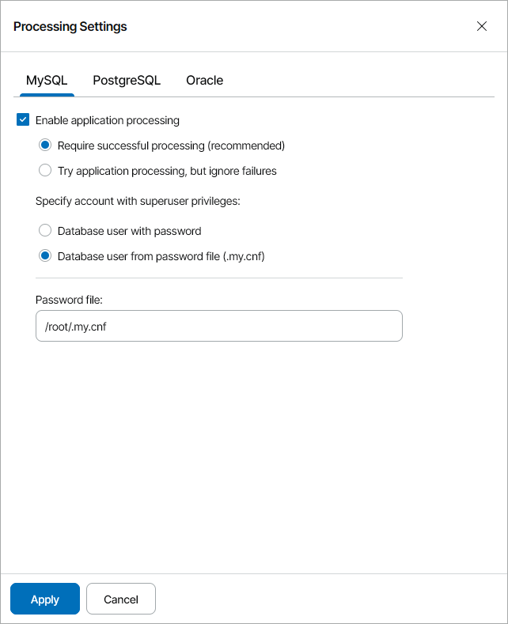
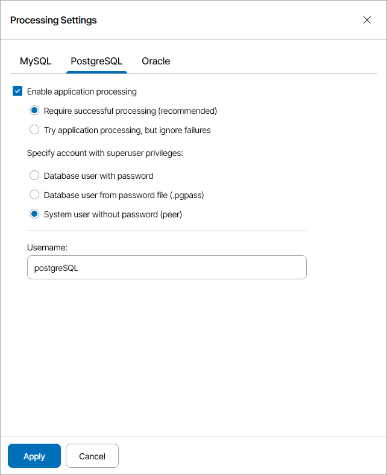
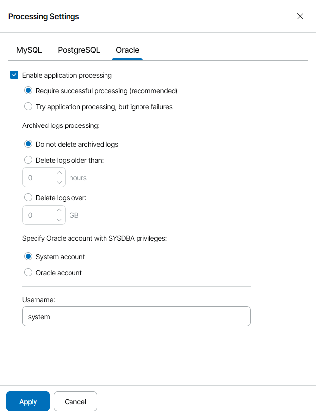
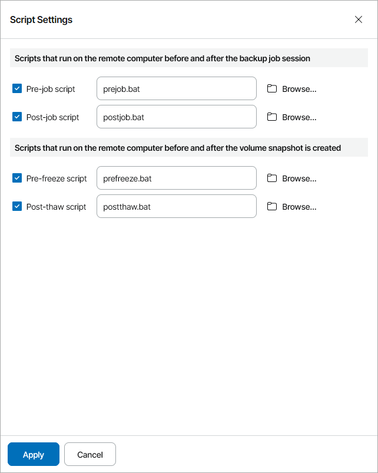
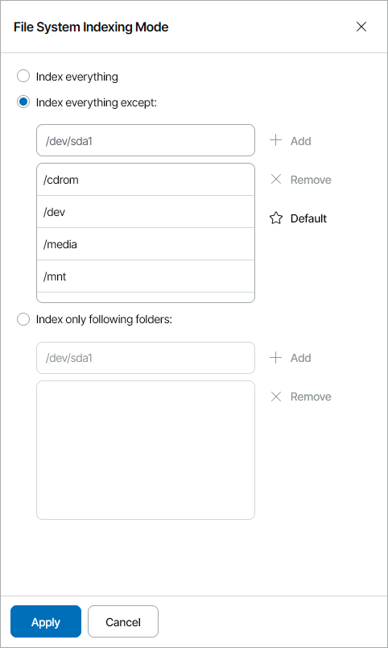

# Step 16. Specify Guest OS Processing Options

The Guest Processing step of the wizard is available if at the [Backup Mode](choose_operation_mode_lin.md) step you have chosen the Server operation mode.

At this step, you can enable the following settings for guest OS processing:

* [Application-aware processing](#appaware)

* [Use of backup job and snapshot scripts](#scripts)

* [File indexing](#indexing)

Application-Aware Processing

If a machine protected with Veeam Agent for Linux runs an Oracle, MySQL or PostgreSQL database system, you can enable application-aware processing to create a transactionally consistent backup. The transactionally consistent backup guarantees proper recovery of databases without data loss.

To enable application-aware processing:

1. At the Guest Processing step of the wizard, click the Customize application handing options link.

The Processing Settings window will open.

1. On the MySQL tab, specify processing settings for the MySQL database:

1. Select the Enable application processing check box.
2. Select one of the following options:

* Require successful processing. With this option selected, Veeam Agent for Linux will stop the backup process if an error occurs when processing the MySQL database system.
* Try application processing, but ignore failures. With this option selected, Veeam Agent for Linux will continue the backup process even if errors occur when processing the MySQL database system.

1. Specify how Veeam Agent for Linux will connect to the MySQL database:

* Select the Database user with password option, if you want Veeam Agent for Linux to connect with the MySQL account name and password.

With this option selected, you must specify account name and password in the backup job settings.

* Select the Database user from password file option, if you want Veeam Agent for Linux to connect with the MySQL account name and password that are stored in the .my.cnf password file.

With this option selected, you must specify a path to the password file, but do not need to specify account credentials in the backup job settings. For details about password file configuration, see section [Preparing Password File for MySQL Processing](https://helpcenter.veeam.com/docs/agentforlinux/userguide/mysql_pass_file_wizard.html) of the Veeam Agent for Linux User Guide.

1. On the PostgreSQL tab, specify processing settings for the PostgreSQL database:

1. Select the Enable application processing check box.
2. Select one of the following options:

* Require successful processing. With this option selected, Veeam Agent for Linux will stop the backup process if an error occurs when processing the PostgreSQL database system.
* Try application processing, but ignore failures. With this option selected, Veeam Agent for Linux will continue the backup process even if errors occur when processing the PostgreSQL database system.

1. Specify how Veeam Agent for Linux will connect to the PostgreSQL database:

* Select the Database user with password option, if you want Veeam Agent for Linux to connect with the PostgreSQL account name and password.

With this option selected, you must specify account name and password in the backup job settings.

* Select the Database user from password file option, if you want Veeam Agent for Linux to connect with the PostgreSQL account password that is stored in the .pgpass password file.

With this option selected, you must specify account name only in the backup job settings. For details about password file configuration, see section [Password File for PostgreSQL](https://helpcenter.veeam.com/docs/agentforlinux/userguide/postgresql_pass_file_wizard.html) of the Veeam Agent for Linux User Guide.

* Select the System user without password option, if you want Veeam Agent for Linux to connect using a peer authentication method.

In the peer authentication method, Veeam Agent for Linux uses the OS account as the PostgreSQL database user name. With this option selected, you must specify OS account in the backup job settings. For details about peer authentication, see [PostgreSQL documentation](https://www.postgresql.org/docs/current/auth-peer.html).

1. On the Oracle tab, specify processing settings for the Oracle database:

1. Select the Enable application processing check box.
2. Select one of the following options:

* Require successful processing. With this option selected, Veeam Agent for Linux will stop the backup process if an error occurs when processing the Oracle database system.
* Try application processing, but ignore failures. With this option selected, Veeam Agent for Linux will continue the backup process even if errors occur when processing the Oracle database system.

1. Specify archived logs processing settings:

* Select the Do not delete archived logs option, if you want Veeam Agent for Linux to keep archived logs.

It is recommended that you select this option when you do not have databases running in the ARCHIVELOG mode. If the database is running in the ARCHIVELOG mode, archived logs may grow large and consume all disk space. In this case, the database administrator must take care of archived logs themselves.

* Select the Delete logs older than or Delete logs over options, if you want Veeam Agent for Linux to delete archived logs that are older than <N> hours or larger than <N> GB.

Veeam backup agent will wait for the backup job to complete successfully and then trigger archived logs truncation using Oracle Call Interface (OCI). If the backup job fails, the logs will remain untouched until the next successful backup job session.

1. In the Specify Oracle account with SYSDBA privileges section, specify which account type Veeam Agent for Linux will use to connect to the database system.

* Select the System account option, if you want Veeam Agent for Linux to use an account of the Veeam Agent machine OS. The account must be a member of the group that owns Oracle database files.
* Select the Oracle account if you want Veeam Agent for Linux to use an Oracle account. The account must have SYSDBA rights.

Use of Backup Job and Snapshot Scripts

To specify custom scripts for the job:

1. At the Guest Processing step of the wizard, select the Enable script execution check box.
2. Click the Customize scripts settings link.
3. In the Script Settings window, specify custom scripts that you want to execute:

* In the Pre-job script field, specify a path to the script that should be executed before the backup job starts.
* In the Post-job script field, specify a path to the script that should be executed after the backup job completes.
* In the Pre-freeze script field, specify a path to the script that should be executed before Veeam Agent for Linux creates a volume snapshot.
* In the Post-thaw script field, specify a path to the script that should be executed after Veeam Agent for Linux creates a volume snapshot.

|  |
| --- |
| Note: |
| Veeam Agent for Linux supports only script files in SH format. Scripts must have UNIX line endings (LF). For details on custom scripts, see section [Backup Job Scripts](https://helpcenter.veeam.com/docs/agentforlinux/userguide/backup_job_script.html) of the Veeam Agent for Linux User Guide. |

File Indexing

To specify guest OS indexing options:

1. At the Guest Processing step of the wizard, select the Enable file system indexing check box.
2. Click the Customize advanced file system indexing options link.
3. In the File System Indexing Mode window, specify the indexing scope:

* Select Index everything to index all files within the backup scope. Veeam backup agent will index all files that reside on your computer OS (for entire computer backup), on the volumes that you have selected for backup (for volume-level backup), in the directories that you have selected for backup (for file-level backup).
* Select Index everything except to index all files on your computer OS except those defined in the list.

By default, system directories /cdrom, /dev, /media, /mnt, /proc, /tmp and /lost+found are excluded from indexing. You can add or delete folders using the Add and Remove buttons on the right.

* Select Index only following folders to define folders that you want to index. You can add or delete directories to index using the Add and Remove buttons on the right.

For details on file system indexing, see section [File System Indexing](https://helpcenter.veeam.com/docs/agentforlinux/userguide/backup_job_indexing.html) of the Veeam Agent for Linux User Guide.

