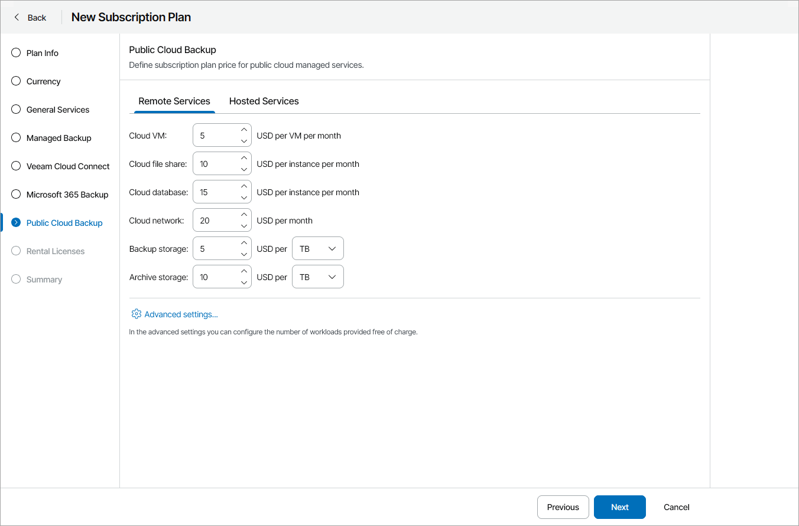
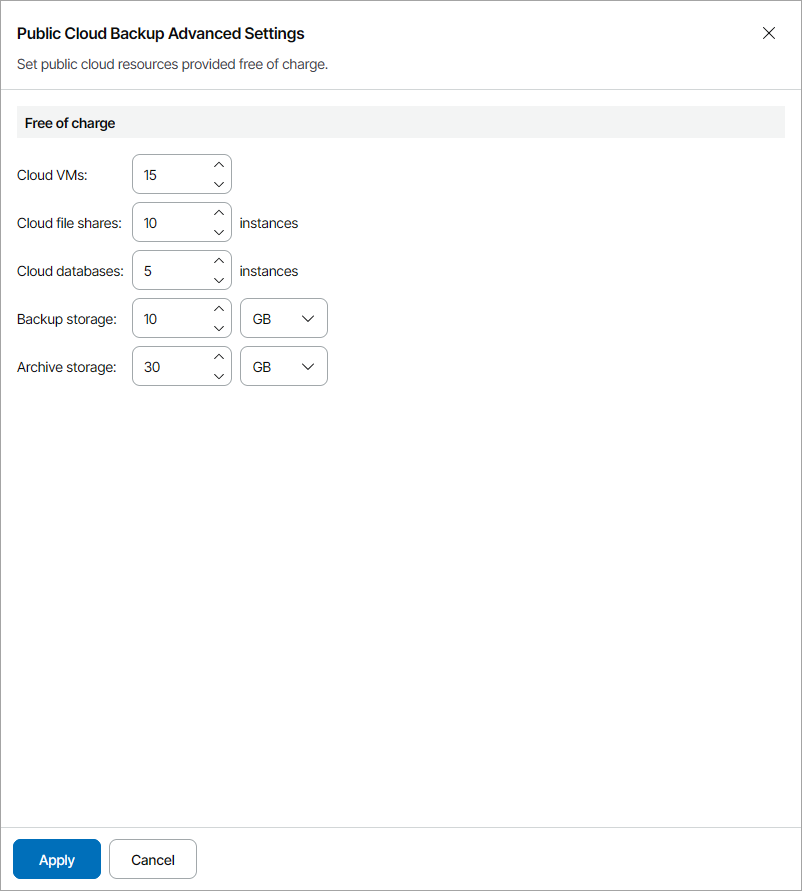

# Step 8. Specify Rates for Public Cloud Services

At the Public Cloud Backup step of the wizard, on the Remote Services and Hosted Services tabs, specify charge rates for managed public cloud services:

* In the Cloud VM field, specify a charge rate for a managed public cloud VM.
* In the Cloud file share field, specify a charge rate for a managed public cloud file share.
* In the Cloud database field, specify a charge rate for a managed public cloud database.
* In the Cloud network field, specify a flat charge rate for managed public cloud network configurations.

* In the Backup storage field, specify a charge rate for managing one GB or TB of backups stored in public cloud repositories.
* In the Archive storage field, specify a charge rate for managing one GB or TB of backups stored in public cloud archive repositories.

If you do not want to charge for a specific service, do not specify a charge rate for it (leave the field blank). If no rate is specified for a service, Veeam Service Provider Console will not take this service into account when calculating the total payment.

For details on chargeable services, see [Services](services.md#public).

For each type of provided services, you can specify the number of cloud VMs, file shares and databases that will be managed free of charge:

1. Click Advanced settings.
2. In the Free of charge section, specify the number of workloads and the amount of storage space for which you will not apply charges.
3. Click Apply.

