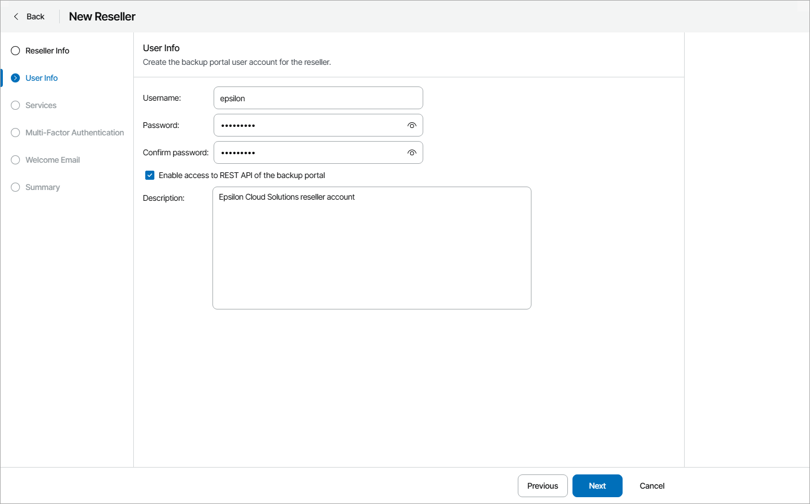

# Step 3. Specify User Credentials

At the User Info step of the wizard, specify the following settings:

1. In the Username, Password and Confirm password fields, specify user credentials of a Service Provider Global Administrator.

The reseller will use these credentials to access the Veeam Service Provider Console Reseller Portal. For details on the Service Provider Global Administrator, see section [User Roles and Permissions](https://helpcenter.veeam.com/docs/vac/reseller/portal_user_roles_permissions.html#service-provider-global-administrator) of the Guide for Resellers.

1. To allow Service Provider Global Administrator and Service Provider Administrators to utilize Veeam Service Provider Console REST API capabilities, select the Enable access to REST API of the backup portal check box.
2. In the Description field, add description for the reseller account.

