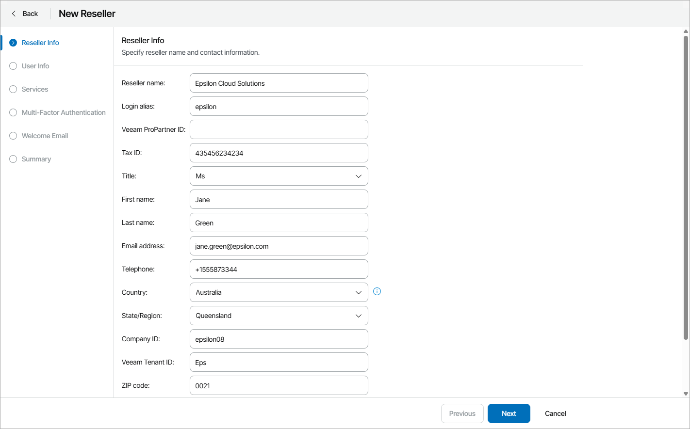

# Step 2. Specify Reseller Details

At the Reseller Info step of the wizard, specify general details:

1. In the Reseller name field, type a reseller name.
2. In the Login alias field, specify a short name for login to the backup portal.
3. In the Veeam ProPartner ID field, specify reseller ProPartner ID.

You can obtain ProPartner ID from a reseller, who is registered in the [Veeam ProPartner Program](https://www.veeam.com/propartner.html).

If you have configured VCSP Pulse integration, this field will be inactive. ProPartner ID will be obtained automatically after the reseller configures VCSP Pulse integration.

1. In the Tax ID field, type the reseller tax identification number.
2. In the Title field, choose how to address a contact person of a reseller (Mr., Miss, Mrs., Ms.).
3. In the First name and Last name fields, specify the first and last names of a contact person of a reseller.
4. In the Email address field, specify a contact email address.

The email address will be used to send to email notifications, such as welcome and alarm notifications.

1. In the Telephone field, specify a contact phone number.
2. In the Country list, choose a country where the reseller is located.
3. In the State/Region list, choose a region where the reseller is located.

The specified country and region will be used to display the reseller on the Companies State by Region map on the Overview dashboard. For details, see [Overview](overview.md).

1. In the Company ID field, type a reseller ID that will be used for integrating Veeam Service Provider Console with 3rd party systems.

You can specify an ID that is assigned to the reseller in a 3rd party system, and synchronize company data between this 3rd party system and Veeam Service Provider Console through data export/import, using this ID.

1. In the Veeam Tenant ID field, type a tenant ID that will be used for integrating Veeam Service Provider Console with VCSP Pulse.

If you have configured VCSP Pulse integration, this field will be inactive. Tenant ID will be obtained automatically after you configure VCSP Pulse reseller mapping.

1. In the ZIP code field, specify a postal code.
2. In the Website field, specify an URL of a reseller website.
3. In the Additional notes field, type any additional details or comments.

The specified reseller name, tax ID, first and last name of the contact person, phone number, country and state will be displayed in invoices.

