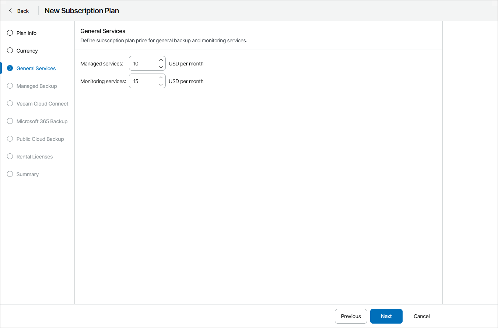

# Step 4. Specify Rates for General Services

At the General Services step of the wizard, specify charge rates for provided services:

* In the Managed services field, specify a flat charge rate for provided services, per month.
* In the Monitoring services field, specify a flat charge rate for provided monitoring services, per month.

For description on provided managed and monitoring services, see [Services](services.md#management).

