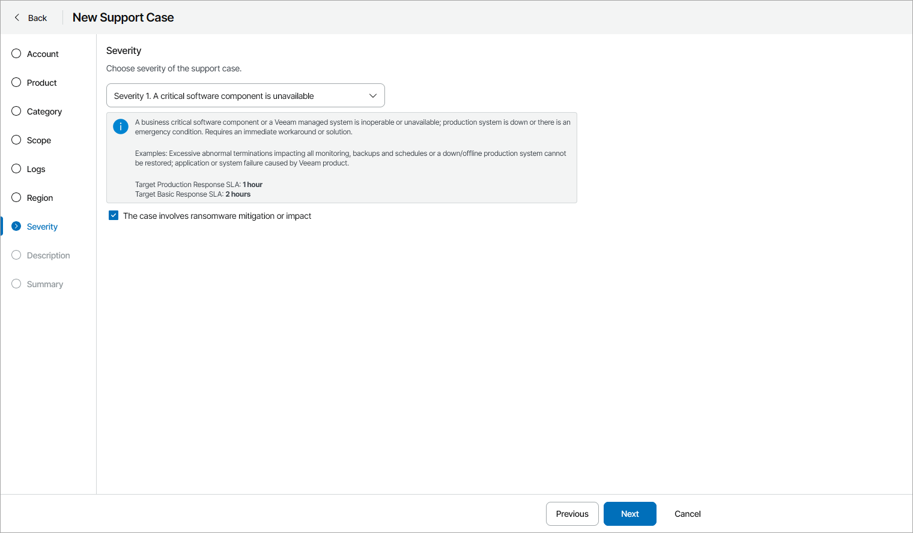

# Step 11. Specify Severity

At the Severity step of the wizard, select support case severity. For details on severity definitions, see [Veeam Customer Support Policy](https://www.veeam.com/support-policy.html?ad=in-text-link#severity-definitions-sla).

If your issue is caused by ransomware, select Severity 1 from the drop-down list and select the This case involves ransomware mitigation or impact check box.

