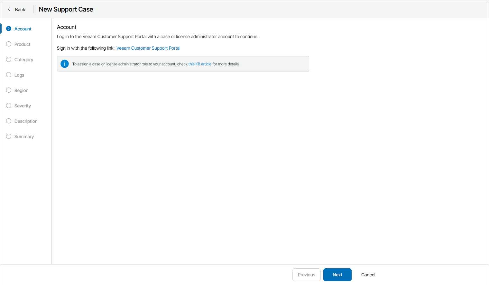

# Step 2. Specify Veeam Customer Technical Support Account

At the Account step of the wizard, select Veeam Customer Technical Support account and contract to open a support case:

1. Click the Veeam Customer Technical Support Portal sign-in link.

A Veeam Customer Technical Support portal sign-in page will open.

1. Specify Case Administrator or License Administrator credentials and click Sign In.

For details on account permissions, see [this Veeam KB article](https://www.veeam.com/kb2211).

You will be automatically redirected back to Veeam Service Provider Console portal.

1. From the Account drop-down list select a Veeam Customer Technical Support account under which you want to open a support case.
2. From the Contract drop-down list, select Veeam Customer Technical Support contract.

