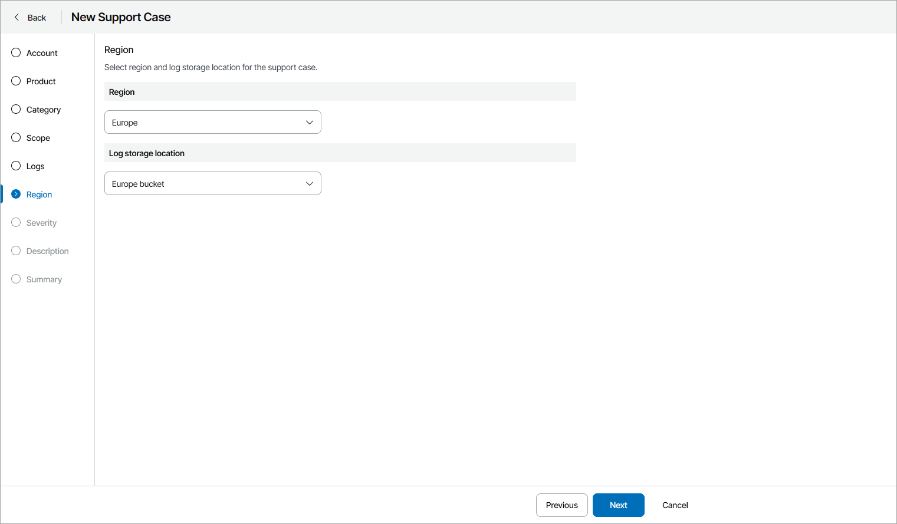

# Step 10. Specify Support Region

At the Region step of the wizard, select Veeam Customer Technical Support region and log storage location for the support case:

* In the Region section, select Veeam Customer Technical Support region where you want to create the support case.
* In the Log storage location section, select bucket to upload log files.

