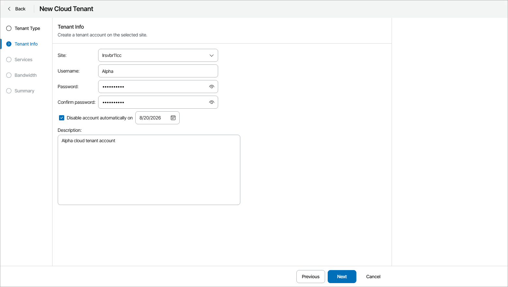
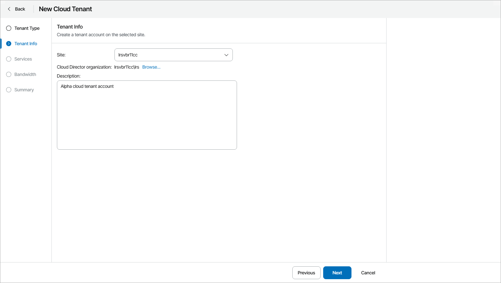

# Step 3. Specify Cloud Tenant Credentials

At the Tenant Info step of the wizard, specify the following settings:

* For the Native Veeam Cloud Connect tenant accounts:

1. From the Site drop-down list, select the site of the Veeam Cloud Connect server where you want to create the cloud tenant account.
2. In the Username, Password and Confirm password fields, specify user credentials of the Company Tenant.

The client will use these credentials to connect to the service provider in Veeam Backup & Replication and access the Veeam Service Provider Console Client Portal. For details on the Company Tenant, see [Managing Company Tenants](manage_company_tenants.md).

The user name must meet the requirements of a Veeam Cloud Connect tenant name. For details, see section [Specify Tenant Settings](https://helpcenter.veeam.com/docs/backup/cloud/cloud_connect_user_settings.html) of the Veeam Cloud Connect Guide.

1. To limit the period during which the cloud tenant can access allocated Veeam Cloud Connect resources, select the Disable account automatically on check box and specify a date when the lease period must terminate.

Lease settings apply to quotas on all cloud resources allocated to the cloud tenant.

If you do not enable the lease expiration option, the cloud tenant will be able to use cloud resources for an indefinite period of time.

1. In the Description field, add a description for the cloud tenant account.

* For the VMware Cloud Director company accounts:

1. From the Cloud Connect server drop-down list, select the Veeam Cloud Connect server where you want to create the cloud tenant account.
2. In the Cloud Director organization field, click the Browse link, to select the organization whose organization vDCs will act as cloud hosts for client VM replicas.

Veeam Service Provider Console will register a VMware Cloud Director Tenant Account on the selected Veeam Cloud Connect server. The name of the organization will be used as the name of the cloud tenant in Veeam Service Provider Console.

To connect to the service provider in Veeam Backup & Replication and access the Veeam Service Provider Console Client Portal, clients with the VMware Cloud Director account type must use the user name and password of the Organization Administrator account of the selected VMware Cloud Director Organization. The user name of the tenant account must be specified in the Organization\Username format.

1. In the Description field, add a description for the cloud tenant account.

